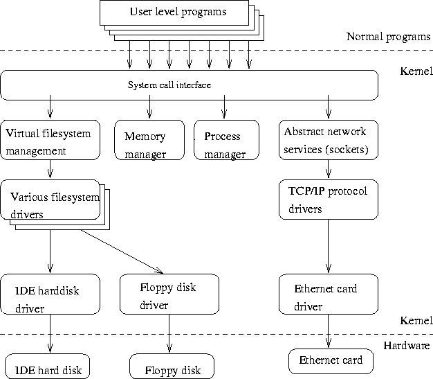
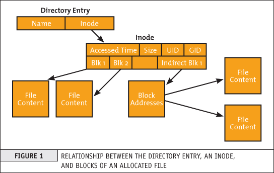
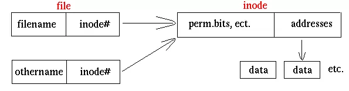
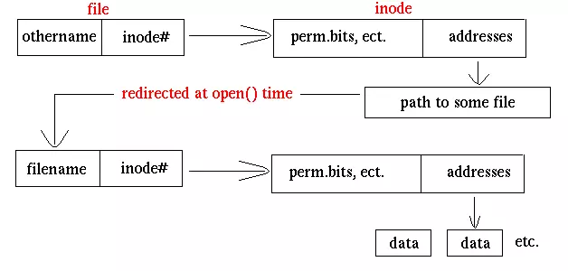
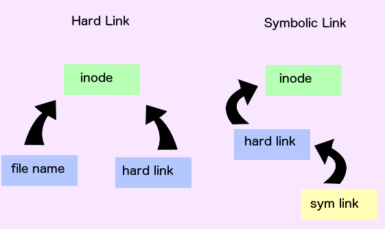
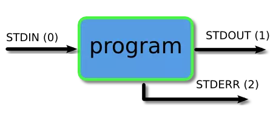
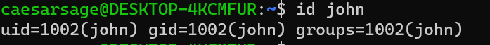

# my-linux-learning
<details>
<summary>
<b>Module 1 - Understanding Linux Concepts</b>
</summary>

- <details>
  <summary>
  <b>Unix vs Linux</b>
  </summary>

  **Unix** lần đầu tiên được phát triển cho multi-user và multi-tasking vào giữa 1970. Lúc này đã có hệ điều hành nhưng chưa cho phép thực hiện multi-user và multi-tasking cho nên Unix đã được phát triển.
  
  Sau đó Linux sinh ra trong 1991 bởi Linus Torvalds

  Linux là open-source và mostly free. Nghĩa là chúng ta có thể cài đặt Linux OS trên bất kì hardware nào, có một số distribution của Linux không hẳn miễn phí như *Redhat*. Linux code bắt nguồn từ Unix thực chất là public ra cho cộng đồng. Thế nên mọi người có thể vào và thay đổi bên trong nó và tạo ra các hđh mà họ muốn.

  Unix được sử dụng chủ yếu bởi **Sun** và hệ điều hành được gọi là **Solaris**. **Sun** bây giờ đã được mua bởi **Oracle**.

  Linux được sử dụng chủ yếu bởi cộng đồng developer hoặc một số công ty như Redhat, CentOS, Debian và còn rất nhiều nữa...

  Unix hỗ trợ tương đối ít File system hơn. Trong khi đó rất nhiều File System được hỗ trợ bởi Linux.
  </details>

- <details>
  <summary>
  <b>Hard Disk</b>
  </summary>

  Một đĩa cứng là một phần của một đơn vị, thường đc gọi là "disk drive", "hard drive", hoặc "hard disk drive", lưu trữ và cung cấp khả năng truy cập tương đối nhanh vào một lượng lớn data trên một bề mặt hoặc trên tập hợp các bề mặt được tích điện từ tính. Máy tính ngày nay thường đi kèm với một đĩa cứng chứa hàng tỉ byte (gigabyte) dung lượng lưu trữ.

  Một đĩa cứng thực sự là một tập hợp các "đĩa" xếp chồng lên nhau, mỗi cái đĩa giống như một "đĩa phát nhạc", có dữ liệu được ghi lại bằng từ tính trong các vòng tròn đồng tâm hay "tracks" trên đĩa. Một "head" (một thứ gì đó giống như kim đọc dữ liệu trên đĩa phát nhạc nhưng nằm ở một vị trí tương đối cố định) sẽ ghi (write) hoặc đọc (read) các thông tin được ghi trên các track của đĩa. Hai heads, một ở mỗi bên của một đĩa sẽ đọc hoặc ghi dữ liệu khi đĩa quay. Mỗi lần đọc ghi sẽ yêu cầu định vị dữ liệu, đây là một thao tác gọi là "seek" (Dữ liệu đã có trong disk cache sẽ được định vị nhanh hơn)

  Một đơn vị hard disk/drive đi kèm với một tốc độ quay cố định, dao động từ 4500 đến 7200 rpm. Thời gian truy cập đĩa được đo bằng milliseconds. Mặc dù vị trí vật lý có thể được xác định bằng các vị trí cylinder, track, và sector, những vị trí này thực ra được ánh xạ tới một logical block address (LBA) hoạt động với phạm vi địa chỉ lớn hơn trên các đĩa cứng ngày nay.
  </details>

- <details>
  <summary>
  <b>Disk Cache</b>
  </summary>

  Disk Cache là một cơ chế giúp cải thiện thời gian dùng để đọc hoặc ghi vào một hard disk. Ngày nay, disk cache thường được đính kèm  như là một phần của hard disk. Một disk cache còn có thể là một porition cụ thể nào đó của RAM.

  Disk cache lưu giữ dữ liệu vừa được đọc, và trong một số trường hợp, là các vùng dữ liệu lân cận có khả năng được truy cập tiếp theo. Write caching đôi khi cũng được cung cấp cùng với một số disk caches.
  </details>

- <details>
  <summary>
  <b>Inside Linux</b>
  </summary>

  - <details>
    <summary>
    <b>Kernel</b>
    </summary>

    - Là lõi của hệ thống UNIX. Được load khi hệ thống khởi chạy (boot), là một chương trình điều khiển cư trú trong bộ nhớ (memory-resident control program), nghĩa là một loại phần mềm hệ thống được nạp vào bộ nhớ chính của máy tính và lưu trú tại đó để kiểm soát và quản lý tài nguyên của hệ thống máy tính, chẳng hạn như bộ nhớ, thiết bị ngoại vi và các tiến trình (processes).
    - Quản lý toàn bộ tài nguyên của hệ thống, trình bày chúng cho bạn và mọi người dùng khác như một hệ thống nhất quán. Cung cấp dịch vụ cho các ứng dụng người dùng như quản lý thiết bị, lập lịch tiến trình, v.v.
    - Một số chức năng được thực hiện bởi Kernel như:
      - Quản lí bộ nhớ của máy và cấp phát chúng cho mỗi tiến trình.
      - Lập lịch các thao tác được thực hiện bởi CPU và nhờ thế các thao tác được thực hiện một cách hiệu quả nhất.
      - Thực hiện việc chuyển dữ liệu từ một phần của máy tính sang phần khác.
      - Diễn giải và thực thi các lệnh từ shell.
      - Thực thi quyền truy cập tệp tin.
    </details>

  - <details>
    <summary>
    <b>Shell</b>
    </summary>

    - Mỗi khi chúng ta login vào hệ thống Unix, chúng ta được đặt vào một chương trình shell. Prompt của shell này thuờng được hiển thị tại vị trí con trỏ trên màn hình của chúng ta. Để hoàn thành công việc của mình, chúng ta nhập lệnh vào promt này.
    - Shell là một trình diễn giải lệnh; nó nhận từng lệnh và chuyển nó đến kernel của hệ điều hành để thực thi. Sau đó, nó hiển thị kết quả của thao tác này trên màn hình.
    - Trên bất kỳ hệ thống UNIX nào, thường có nhiều loại shell khác nhau, mỗi loại có những ưu điểm và nhược điểm riêng.
    - Các người dùng khác nhau có thể sử dụng các shell khác nhau. Ban đầu, quản trị viên hệ thống của bạn sẽ cung cấp một shell mặc định, nhưng bạn có thể thay đổi hoặc ghi đè lên nó. Các shell phổ biến nhất thường có trên hệ thống bao gồm:
      - Bourne shell (sh)
      - C shell (csh)
      - Korn shell (ksh)
      - TC shell (tcsh)
      - Bourne Again shell (bash)
    - Mỗi shell cũng bao gồm ngôn ngữ lập trình riêng của nó. Các tệp lệnh, được gọi là "shell scripts," được sử dụng để thực hiện một chuỗi các tác vụ.
    </details>

  - <details>
    <summary>
    <b>Utilities</b>
    </summary>

    - UNIX cung cấp hàng trăm chương trình tiện ích (utilities programs), thường được gọi là các lệnh (commands).
    - Các lệnh UNIX thực hiện các chức năng phổ quát, chẳng hạn như:
      - editing
      - file maintenance
      - printing
      - sorting
      - programming support
      - online info etc.
    - Tính module: các chương trình đơn lẻ có thể nhóm lại để thực hiện các tác vụ phức tạp.
    </details>
  </details>

- <details>
  <summary>
  <b>Operating system</b>
  </summary>

  Một hệ điều hành hay OS là một chương trình cho phép các phần cứng máy tính có thể tương tác và giao tiếp với các phần mềm trên máy tính. Nếu không có hệ điêu hành, các chương trình máy tính và phần mềm sẽ trở nên vô dụng.

  OS là chương trình sau khi được tải vào máy tính bởi một chương trình khởi động (boot program), sẽ quản lý tất cả các chương trình khác trong máy tính. Các chương trình khác được gọi là ứng dụng hoặc chương trình ứng dụng. Các chương trình ứng dụng sử dụng hệ điều hành bằng cách gửi yêu cầu dịch vụ thông qua một giao diện chương trình ứng dụng (API) đã được định nghĩa. Ngoài ra, người dùng có thể tương tác trực tiếp với hệ điều hành thông qua giao diện người dùng, chẳng hạn như ngôn ngữ lệnh hoặc giao diện người dùng đồ họa (GUI).

  Một hệ điều hành sẽ thực hiện các dịch vụ sau đây cho chương trình:
  - Trong một hệ điều hành đa nhiệm, nơi nhiều chương trình có thể chạy đồng thời, hệ điều hành xác định các ứng dụng nào nên chạy theo thứ tự nào và mỗi ứng dụng được phép sử dụng bao nhiêu thời gian trước khi chuyển cho ứng dụng khác.
  - Nó quản lý việc chia sẻ bộ nhớ nội bộ giữa nhiều ứng dụng.
  - Nó xử lý việc nhập và xuất dữ liệu từ và đến các thiết bị phần cứng gắn liền, chẳng hạn như ổ cứng, máy in.
  - Nó truyền message tới mỗi ứng dụng hoặc người dùng đang tương tác (hoặc đến một operator trong hệ thống) về trạng thái hoạt động và bất kì lỗi nào có thể xảy ra.
  - Nó có thể chuyển giao việc quản lý cho các **batch job** (chẳng hạn như thao tác in) và cho phép ứng dụng khởi tạo không phải chịu trách nhiệm thao tác.
  - Trong các máy tính có thể xử lí đồng thời. Một hệ điều hành có thể quản lí việc phân chia chương trình để có thể chạy trên nhiều processor tại một thời điểm.
  </details>

- <details>
  <summary>
  <b>Various Parts of an Operating System</b>
  </summary>

  UNIX và các hệ điều hành giống UNIX (như Linux) bao gồm một Kernel và một số chương trình hệ thống (system program). Ngoài ra, còn có các chương trình ứng dụng (application program) để thực thi công việc. Kernel là phần cốt lõi của hệ điều hành. Thực tế thì Kernel thường bị nhầm lẫn là hệ điều hành nhưng không phải vậy. Hệ điều hành bản thân nó cung cấp nhiều dịch vụ hơn so với Kernel.

  Nó theo dõi các tập tin trên đĩa, khởi động chương trình và chạy chúng một cách đồng thời, cấp phát bộ nhớ và các tài nguyên khác nhau cho nhiều process, nhận các packet và gửi chúng thông qua mạng và tương tự như vậy. Kernel bản thân nó thực hiện rất ít việc, nhưng nó cung cấp các công cụ mà các dịch vụ có thể được xây dựng dựa trên. Ngoài ra nó cũng ngăn chặn bất kì ai truy cập trực tiếp vào các phần cứng, ép họ sử dụng các công cụ mà nó cung cấp. Với cách này Kernel sẽ cung cấp được một số bảo vệ cho người dùng. Các công cụ được cung cấp bởi Kernel được sử dụng thông qua system call.

  Các system program sử dụng tool được cung cấp bởi Kernel để implement một số service được yêu cầu bởi hệ điều hành. System program, và tất cả các loại program khác, chạy *on top* của một Kernel, hay còn được gọi là *user mode*. Sự khác biệt giữa *system program* và *application program* nằm ở mục đích sử dụng:
  - **application program - chương trình ứng dụng**: được thiết kế để thực thi các công việc tiện ích (để giải trí, nếu đó là một trò chơi). Ví dụ: chương trình xử lí văn bản là một chương trình ứng dụng.
  - **system program - chương trình hệ thống**: là cần thiết để cho hệ thống hoạt động. Ví dụ: lệnh **mount** là một chương trình hệ thống .
  
  Tuy nhiên sử khác biệt này thường khá mơ hồ và chỉ quan trọng khi chúng ta thật sự chú trọng vào việc phải phân loại chúng.
  </details>

- <details>
  <summary>
  <b>Important parts of the kernel</b>
  </summary>

  Linux Kernel bao gồm các thành phần quan trọng:

  - Process Management
  - Memory Management
  - Hardware device drivers.
  - Filesystem drivers.
  - Network Management.
  - Various other bits and pieces.
  
  Hình sau cho chúng ta thấy một số thành phần quan trọng của Linux Kernel:

  

  Có lẽ các phần quan trọng nhất của Kernel (không thứ gì có thể hoạt động mà không có chúng) là memory management và process management. Memory Mangement sẽ lo việc cấp phát các không gian bộ nhớ và swap các không gian đến process, đến các phần của kernel và đến các bộ nhớ đệm. Process Management sẽ tạo ra các process, và implement tính đa nhiệm bằng cách chuyển đổi process hoạt động trên processor.

  Ở mức độ thấp nhất, kernel (nhân hệ điều hành) chứa một driver thiết bị phần cứng cho mỗi loại phần cứng mà nó hỗ trợ. Vì thế giới đầy rẫy các loại phần cứng khác nhau, số lượng driver thiết bị phần cứng là rất lớn. Thường thì có nhiều phần cứng tương tự nhau nhưng khác nhau về cách điều khiển bằng phần mềm. Sự tương đồng này cho phép có các lớp driver tổng quát hỗ trợ các hoạt động tương tự; mỗi thành viên của lớp đó có cùng giao diện với phần còn lại của kernel nhưng khác nhau ở những gì cần làm để thực hiện các hoạt động đó. Ví dụ, tất cả các driver ổ đĩa đều giống nhau với phần còn lại của kernel, tức là chúng đều có các hoạt động như `khởi tạo ổ đĩa`, `đọc sector N`, và `ghi sector N`.
  </details>

- <details>
  <summary>
  <b>Various Parts of an Operating System</b>
  </summary>

  UNIX và các hệ điều hành giống UNIX (như Linux) bao gồm một Kernel và một số chương trình hệ thống (system program). Ngoài ra, còn có các chương trình ứng dụng (application program) để thực thi công việc. Kernel là phần cốt lõi của hệ điều hành. Thực tế thì Kernel thường bị nhầm lẫn là hệ điều hành nhưng không phải vậy. Hệ điều hành bản thân nó cung cấp nhiều dịch vụ hơn so với Kernel.

  Nó theo dõi các tập tin trên đĩa, khởi động chương trình và chạy chúng một cách đồng thời, cấp phát bộ nhớ và các tài nguyên khác nhau cho nhiều process, nhận các packet và gửi chúng thông qua mạng và tương tự như vậy. Kernel bản thân nó thực hiện rất ít việc, nhưng nó cung cấp các công cụ mà các dịch vụ có thể được xây dựng dựa trên. Ngoài ra nó cũng ngăn chặn bất kì ai truy cập trực tiếp vào các phần cứng, ép họ sử dụng các công cụ mà nó cung cấp. Với cách này Kernel sẽ cung cấp được một số bảo vệ cho người dùng. Các công cụ được cung cấp bởi Kernel được sử dụng thông qua system call.

  Các system program sử dụng tool được cung cấp bởi Kernel để implement một số service được yêu cầu bởi hệ điều hành. System program, và tất cả các loại program khác, chạy *on top* của một Kernel, hay còn được gọi là *user mode*. Sự khác biệt giữa *system program* và *application program* nằm ở mục đích sử dụng:
  - **application program - chương trình ứng dụng**: được thiết kế để thực thi các công việc tiện ích (để giải trí, nếu đó là một trò chơi). Ví dụ: chương trình xử lí văn bản là một chương trình ứng dụng.
  - **system program - chương trình hệ thống**: là cần thiết để cho hệ thống hoạt động. Ví dụ: lệnh **mount** là một chương trình hệ thống .
  
  Tuy nhiên sử khác biệt này thường khá mơ hồ và chỉ quan trọng khi chúng ta thật sự chú trọng vào việc phải phân loại chúng.
  </details>

- <details>
  <summary>
  <b>Virtual Memory</b>
  </summary>

  Linux hỗ trợ **Virtual Memory**, tức là sử dụng một disk như là một phần của RAM và do đó kích thước có thể sử dụng của RAM được tăng lên tương ứng. Kernel sẽ viết nội dung của các block không sử dụng trong bộ nhớ xuống đĩa cứng mà nhờ đó, bộ nhớ có thể sử dụng cho mục đích khác. Khi mà nội dung gốc được yêu cầu, chúng sẽ được đọc lại vào bộ nhớ. Thao tác này được xử lí một cách hoàn toàn vô hình với người dùng; các chương trình trong Linux chỉ thấy một phần lớn hơn của bộ nhớ sẵn sàng để sử dụng và không nhận ra là một phần trong số đó nằm trên đĩa cứng. Tất nhiên, việc đọc và viết lên đĩa cứng sẽ chậm hơn (thậm chí là hàng ngàn lần) so với bộ nhớ thực, do đó chương trình sẽ không chạy nhanh. Phần đĩa cứng được dùng như bộ nhớ ảo được gọi là **không gian swap - swap space**.

  Linux có thể sử dụng một file bình thường trong filesystem hoặc một partition riêng biệt trên đĩa cứng để làm swap space. Swap Partition sẽ nhanh hơn, nhưng sẽ dễ dàng hơn để thay đổi kích thước của một Swap File (không cần phải thay đổi partition trên một đĩa cứng, việc mà có thể phải cài đặt tất cả mọi thứ lại từ đầu). Thế nên, khi chúng ta biết rõ swap space cần thiết là bao nhiêu thì nên sử dụng swap partition, còn nếu không chắc chắn thì chúng ta nên sử dụng swap file trước tiên, sử dụng hệ thống một thời gian để có cảm giác chắc chắn được bao nhiêu swap space là bao nhiêu.

  Chúng ta cũng nên biết rằng Linux cho phép sử dụng nhiều phân vùng swap (swap partition) và/hoặc tập tin swap (swap file) cùng một lúc. Điều này có nghĩa là nếu ta chỉ thỉnh thoảng cần một lượng không gian swap bất thường, ta có thể thiết lập một tập tin swap bổ sung vào những lúc đó, thay vì giữ toàn bộ lượng không gian được phân bổ suốt thời gian.

  Một lưu ý về thuật ngữ hệ điều hành: khoa học máy tính thường phân biệt giữa swapping (ghi toàn bộ quá trình ra không gian swap) và paging (chỉ ghi các phần có kích thước cố định, thường là vài kilobyte, tại một thời điểm). Paging thường hiệu quả hơn, và đó là những gì Linux thực hiện, nhưng thuật ngữ truyền thống của Linux vẫn nói về swapping.
  </details>
</details>

<details>
<summary>
<b>Module 2 - Install VMWare</b>
</summary>

*Chưa có gì phải ghi chú ở đây*
</details>

<details>
<summary>
<b>Module 3 - System Access And File System</b>
</summary>

- <details>
  <summary>
  <b>Important things to remember in Linux</b>
  </summary>
  
  - Linux có một super-user gọi là **root**.
    - root là account có quyền mạnh nhất có thể tạo, chỉnh sửa, xóa các account khác và thay đổi file system của hệ thống.
  - Linux là case-sentitive
    - **ABC** khác với **abc**
  - Linux Kernel không phải là hệ điều hành. Nó là một "chương trình" nhỏ bên trong hệ điều hành Linux sẽ nhận command từ user và pass chúng vào phần cứng hệ thống.
  - Linux phần lớn sử dụng CLI, không phải GUI.
  - Linux rất flexible khi so với các hệ điều hành khác.
  </details>

- <details>
  <summary>
  <b>Linux File System</b>
  </summary>
  
  - File System là một phần mềm hoặc hệ thống được sử dụng để quản lý, tổ chức và lưu trữ dữ liệu trên các thiết bị lưu trữ như đĩa cứng, ổ đĩa USB hoặc thẻ nhớ
  - OS lưu trữ dữ liệu trên ổ đĩa sử dụng một cấu trúc gọi là File System, bao gồm các file, thư mục, và các thông tin cần thiết để truy cập và định vị chúng.
  - Có nhiều loại filesystem khác nhau. Về cơ bản, có nhiều sự cải tiến đối với file system khi ra mắt các hệ điều hành mới, và mỗi file system được đặt một tên khác nhau:
    - E.g ext3, ext4, XFS, NTFS, FAT, etc.
  - Linux filesystem lưu trữ thông tin trong các thư mục phân cấp và file.
    - Filesystem của Linux trông như thế này:
  
    

  </details>

- <details>
  <summary>
  <b>File System Structure and its Description</b>
  </summary>

  - `/boot`: chứa file được sử dụng bởi bootloader (grub.cfg).
  - `/root`: thư mục home của user root.
  - `/dev`: System devices (eg disk, cdroom, speakers, flashdrive, keyboard etc)
  - `/etc`: Configuration files.
  - `/bin -> /usr/bin`: Everyday user commands.
  - `/sbin -> /usr/sbin`: System/filesystem commands.
  - `/opt`: optional addons applications (các apps không thuộc về OS).
  - `/proc`: Chứa các file, thư mục cho các process đang chạy (bị xóa khi shutdown).
  - `/lib -> /usr/lib`: các file thư viện được viết bằng C cần thiết cho các commands hoặc apps.
  - `/tmp`: thư mục chứa các file tempory.
  - `/home`: thư mục home của user.
  - `/var`: logs của hệ thống.
  - `/run`: các daemons hệ thống chạy rất sớm (e.g systemd và udev) để chứa các file tempory runtime như các file PID.
  - `/mnt`: dùng để mount external filesystem. (e.g NFS)
  - `/media`: dùng để mount cdrom.

  </details>

- <details>
  <summary>
  <b>Navigating File System</b>
  </summary>
  
  Để di chuyển trong UNIX FileSystem, có một số command **quan trọng** cần phải nhớ:
  - `cd - Change Directory`: chuyển thư mục
  - `pwd - Print Working Directory`: Cho biết vị trí hiện tại
  - `ls - listing`: List content
    - `ls -a`: List tất cả (List all).
    - `ls -l`: List đầy đủ thông tin (List long format).
    - `ls -r`: List theo trật tự ngược lại (List with reverse order).
    - `ls -t`: List theo thứ tự thời gian (List with time).
    - `ls -p`: thêm dấu / vào thư mục. (List with indicator-slash)
    - `ls -R`: xem cả cây thư mục (List recursively)
  </details>

- <details>
  <summary>
  <b>What is root</b>
  </summary>
  
  Có 3 loại `root` trong hệ thống Linux mà ta cần phân biệt:
  - Root account: Là một account hay một username trên hệ thống Linux có quyền hạn lớn nhất, được access vào toàn bộ command và file.
  - Thư mục root `/`: Là thư mục đầu tiên trong Linux và còn được biết đến là **root directory** (Lưu ý: đây không phải thư mục user của root).
  - Root home directory: Là thư mục home của user `root`, nằm ở đường dẫn `/root`
  </details>

- <details>
  <summary>
  <b>Creating files and directories</b>
  </summary>
  
  - Tạo file:
    - `touch`: tạo file trống.
    - `cp`: copy file.
      - `cp -R`: copy đệ quy (copy recursively).
    - `vi`: tạo file với trình soạn vi.
  - Tạo thư mục:
    - `mkdir`: tạo thư mục (make directory).
      - `mkdir -p`: tạo cả cây thư mục (make directory parent).
  </details>

- <details>
  <summary>
  <b>Linux File Types</b>
  </summary>

  | Kí hiệu file | Ý nghĩa                     |
  |--------------|-----------------------------|
  | -            | Regular file                |
  | d            | Directory                   |
  | l            | link                        |
  | c            | special file or device file |
  | s            | socket                      |
  | p            | Named pipe                  |
  | b            | block device                |
  </details>

- <details>
  <summary>
  <b>Find files and directories</b>
  </summary>

  Hai lệnh được sử dụng để tìm kiếm file/thư mục:
  - `find`: Tìm kiếm tài nguyên.
    - `find <from_where> -name <search>`: Tìm kiếm tài nguyên theo tên tại from_where.
    - `find <from_where> -type [f | d]`: Tìm kiếm tài nguyên là file (`f`) hoặc thư mục (`d`)
  - `locate`: Tìm kiếm tài nguyên, nhưng là sử dụng cơ sở dữ liệu được lập chỉ mục trước (thường là `/var/lib/mlocate/mlocate.db`) nên rất nhanh.
    - `updatedb`: cập nhật cơ sở dữ liệu chỉ mục.
  </details>

- <details>
  <summary>
  <b>Wildcards</b>
  </summary>

  Wildcards là các kí tự đặc biệt có thể sử dụng để đại diện cho một lớp các kí tự trong các câu lệnh tìm kiếm.

  - `*`: Đại diện cho 0 hoặc nhiều hơn 1 kí tự.
  - `?`: Đại diện cho một kí tự bất kì.
  - `[]`: Đại diện cho một tập hợp các ký tự đơn lẻ mà bạn muốn khớp.
  - `{}`: Đại diện cho một tập hợp các từ hoặc chuỗi (có thể sử dụng để tạo nhiều file)

  Ví dụ:
  - `rm abc*`: xóa tất cả các tài nguyên bắt đầu với `abc`.
  - `touch abc{1..9}-xyz`: tạo 9 file `abc{1 -> 9}-xyz`.
  </details>

- <details>
  <summary>
  <b>Soft and hard links (In details)</b>
  </summary>

  **Một số khái niệm cần biết**:

  Trong hệ thống file Linux, một liên kết (link) là một kết nối giữa file name và dữ liệu thực tế trên disk.

  Có hai loại liên kết chính có thể được tạo: "hard" links, và "soft" hay symbolic links. Trước khi tìm hiểu về hard links và symbolic links, có một khái niệm khác cần hiểu rõ là “inode” - một khái niệm cơ bản trong Linux filesystem. Mỗi đối tượng của filesystem được đại diện bởi một inode.

  **Inode**:
  Trong Linux, dữ liệu của các file được chia thành các block. Có nhiều cách tổ chức để liên kết các khối dữ liệu trong một file với nhau, một trong các cách đó là dùng chỉ mục (indexed allocation).

  

  Trong một inode có các metadata sau:
  - Dung lượng file tính bằng bytes.
  - Device ID : id của thiết bị lưu file.
  - User ID : id chủ sở hữu của file.
  - Group ID: id nhóm của chủ sở hữu file.
  - File mode : gồm kiểu file và cách thức truy cập file.
  - Timestamps: các mốc thời gian khi: bản thân inode bị thay đổi (ctime, inode change time), nội dung file thay đổi (mtime, modification time) và lần truy cập mới nhất (atime, access time).
  - Link count : số lượng hard links trỏ đến inode. Các con trỏ chỉ đến các blocks trên ổ cứng dùng lưu nội dung file. Các con trỏ cho biết file nằm ở đâu để đọc nội dung.
  - ...
  
  >Inode là một cấu trúc dữ liệu trong hệ thống tệp truyền thống của các họ Unix ví dụ như UFS hoặc EXT3. Inode lưu trữ thông tin về 1 tệp thông thường, thư mục, hay những đối tượng khác của hệ thống tệp tin.
  
  Có hai chú ý trong nội dung inode:
  - Inode không chứa tên file, thư mục.
  - Các con trỏ là thành phần quan trọng nhất: nó cho biết địa chỉ các block lưu nội dung file và tìm đến các block đó có thể truy cập được nội dung file.
  
  **Hard link**:
  Hard Link là các liên kết cấp thấp (low-level links) mà hệ thống sử dụng để tạo các thành phần chính hệ thống file, chẳng hạn như file và thư mục. Liên kết cứng sẽ tạo ra một liên kết trong cùng hệ thống tập tin với 2 inode entry tương ứng trỏ đến cùng một nội dung vật lí (cùng số inode vì chúng trỏ đến cùng dữ liệu).

  Tất cả các hệ thống tệp tin dựa trên thư mục phải có ít nhất một liên kết cứng (link counts từ 1 trở lên) cung cấp tên gốc cho mỗi tệp tin.

  
  
  **Symbolic Link**:
  - Hầu hết người dùng không muốn tự tạo hoặc sửa đổi các hard links, nhưng các symbolic links là một công cụ hữu ích cho bất kỳ người dùng Linux nào.
  - **Symbolic links** là một file đặc biệt trỏ đến một file hoặc thư mục khác - được gọi là target. Khi được tạo, một symbolic links có thể được sử dụng thay cho target file. Nó có thể có một tên độc nhất, và được đặt trong bất kỳ thư mục nào. Nhiều symbolic links thậm chí có thể được tạo cho cùng một target file, cho phép truy cập target bằng nhiều tên khác nhau.
  
  

  - Symbolic link không chứa bản sao dữ liệu của target file. Nó tương tự như một shortcut trong Microsoft Windows: nếu bạn xóa một symbolic link, target sẽ không bị ảnh hưởng. Vì chỉ đơn thuần là một shortcut, symbolic link không dùng đến inode entry. Nó sẽ tạo ra một inode mới và nội dung của inode này trỏ đến tên tập tin gốc.
  - Ngoài ra, nếu target của một symbolic link bị xóa, di chuyển hoặc đổi tên, symbolic link không được cập nhật. Khi điều này xảy ra, liên kết tượng trưng được gọi là "broken" hoặc "orphaned" và sẽ không còn hoạt động như một liên kết.

  Lệnh:
  - `ln`: tạo hard link.
  - `ln -s`: tạo soft link.

  

  </details>
</details>

<details>
<summary>
<b>Module 4 - Linux Fundamentals</b>
</summary>

- <details>
  <summary>
  <b>Linux Command Syntax</b>
  </summary>

  Syntax cơ bản của một command là:
  `command` `option` `agrument`
  
  **Options**:
  Thay đổi cách mà command hoạt động.

  Thường bao gồm dấu gach ngang `-` ở phía trước.

  Một số command chấp nhận nhiều options và cho phép group nhiều option đó lại với nhau sau dấu `-`.

  **Agrument**:
  Hầu hết các command đều được sử dụng cùng với một hoặc nhiều tham số.
  
  Một số command sẽ mặc định sử dụng một `default agrument` nếu không được chỉ định rõ.
  
  Tham số có thể là tùy chọn hoặc bắt buộc, tùy thuộc vào command.
  </details>

- <details>
  <summary>
  <b>Access Permission (In Details)</b>
  </summary>

  **Giới thiệu về quyền truy xuất**:
  Quyền là thuộc tính của một tệp và thư mục. Nó cho biết từng đối tượng người dùng (chủ sở hữu, người cùng nhóm, người dùng khác) có quyền gì trên một tệp và thư mục. Linux sử dụng 9 bit cho việc này, trong đó 3 bit đầu cho biết quyền đọc, ghi, thực thi của owner, 3 bit tiếp theo cho biết quyền của group, 3 bit cuối cho biết quyền của other. Trong các lệnh, 3 bit xác định quyền cho một đối tượng người dùng được biểu diễn bằng một số nguyên (có giá trị từ 0 đến 7), quyền được biểu diễn bằng ba số nguyên liên tiếp.

  | Number | Permission Type | Symbol |
  |:------:|:---------------:|:------:|
  | 0 | No Permission | - |
  | 1 | Execute | --x |
  | 2 | Write | -w- |
  | 3 | Execute + Write | -wx |
  | 4 | Read | r-- |
  | 5 | Read + Execute | r-x |
  | 6 | Read + Write | rw- |
  | 7 | Read + Write + Execute | rwx |

  **Quyền cho tệp và thư mục được tạo mới**:
  Với các tệp và thư mục được tạo mới, quyền được xác định dựa trên quyền cơ sở (base permission) và user mask.
  
  Base permission được thiết lập sẵn và không thể thay đổi.

  - Đối với file thông thường thì BS là 666 (`rw-rw-rw`)
  - Đối với thư mục (file đặc biệt) thì BS là 777 (`rwxrwxrwx`)

  Có thể tính nhanh quyền truy xuất tệp và thư mục theo các công thức sau:

  ```
  Quyền truy cập file = 666 - unmask
  Quyền truy cập folder = 777 - unmask
  ```

  Giá trị user mask mặc định cho người dùng thông thường là **002**

  Với mask này thì quyền hạn truy cập mặc định cho thư mục là **775** và file là **664**

  Giá trị mask mặc định cho root là **022**

  Với mask này thì quyền hạn truy cập mặc định cho thư mục là **755** và file là **644**

  Sử dụng chương trình **umask** để thay đổi user mask. **Các tệp và thư mục được tạo ra sau lệnh umask sẽ chịu tác động của giá trị mask mới**.

  **Thay đổi quyền của tệp và thư mục đã tồn tại**:

  Có thể sử dụng chương trình **umask** để thay đổi user mask, sau đó dùng chương trình touch để cập nhật quyền của tệp theo user mask mới . Dưới đây là một ví dụ minh họa việc giá trị user mask quyết định các quyền hạn trên file.txt như thế nào.

  ```sh
  unmask 077
  touch test_file.txt
  ls-l test_file.txt

  > -rw------ 1 uit uit 0 2024-08-20 11:10 test_file.txt
  ```

  Note: *Cơ chế làm việc của umask khiến chúng ta không thể tạo ra các file với quyền execute. Vì Base permission của file luôn là 666, tức các bit ứng với quyền execute đều bằng 0, nên bất kể giá trị mask bằng bao nhiêu thì quyền của file đều không có execute.*

  Cách khác để thay đổi quyền của tệp và thư mục đã tồn tại là sử dụng chmod. Sử dụng chmod có thể thêm quyền thực thi cho tệp và thư mục.

  `chmod [OPTION] MODE FILE`

  trong đó:
  - OPTION hay được dùng nhất là -R hoặc --recursive (đệ quy) khi muốn áp dụng quyền cho tất cả tệp và các thư mục con.
  - MODE cho biết đối tượng người dùng nào (u: user sở hữu; g: group; o: other, a: all) được cấp/thu hồi/gán (+-=) quyền gì (rwxXst hoặc [0-7]+)
  - File là file hoặc folder bạn muốn thay đổi quyền

  **Thay đổi chủ sở hữu của tệp và thư muc**
  Người tạo ra tệp hay thư mục là chủ sở hữu (owner) mặc định của tệp hay thư mục. Quyền sở hữu của tệp hay thư mục còn thuộc owning group. Owner hoặc root có thể thay đổi chủ sở hữu của tệp và thư mục bằng dùng chương trình chown.

  `chown [OPTION] [OWNER][:[GROUP]] FILE`
  
  **SUID, SGID, Sticky bit**
  Ngoài 9 bits cơ bản xác định các quyền rwx của owner, group và other, Linux sử dụng 3 bit khác để định nghĩa quyền trên tệp và thư mục. Các bit này lần lượt là SUID, SGID, Sticky. Trong các lệnh, một số nguyên nữa có giá trị từ 0 đến 7 được dùng để xác định ba quyền này. Ví dụ, trong lệnh

  ```sh
  chmod 6750 file1.txt
  ```
  số 6 (nhị phân là 110) **đầu tiên** trong quyền xác định SUID, SGID được bật, sticky không được bật.

  Ý nghĩa của ba bit SUID, SGID, Sticky được giải thích lần lượt như sau.

  **SUID (Set owner User ID up on execution)**
  Thông thường, khi một chương trình/tệp/lệnh chạy, nó sử dụng các quyền của người dùng hiện tại, hay người dùng chạy nó. Nếu SUID được đặt, chương trình sẽ sử dụng quyền của owner chứ không phải quyền của người dùng hiện tại. Ví dụ, owner của /etc/passwd, /etc/shadow là root. Người dùng thông thường không có quyền ghi các tệp này. Nếu các tệp này không được đặt quyền SUID, khi người dùng chạy lệnh passwd sẽ xuất hiện lỗi do không mở và ghi vào tệp /etc/shadow được. Ngược lại, khi các tệp này được đặt quyền SUID, người dùng thông thường cũng có thể chạy lệnh passwd.

  Ví dụ:
  - Đặt quyền SUID của tệp cho người dùng hiện tại: `chmod u+s file1.txt` hoặc `chmod 4750 file1.txt`
  - Bỏ quyền SUID của tệp đối với người dùng hiện tại: `chmod u-x file1.txt`

  Khi SUID được bật, bit x của owner được hiển thị là s nếu owner có quyền thực thi . Nếu owner không có quyền thực thi, bit x của owner được hiển thị là S. Ví dụ, -rwSrw-r-- có nghĩa là bit SUID đã được bật nhưng bit x của owner không được bật, -rwsrw-r-- có nghĩa là bit SUID đã được bật và bit x của owner được bật, rwxrw-r-- nghĩa là bit SUID không được bật và owner có quyền thực thi.

  **SGID (Set Group ID up on execution)**
  Tương tự SUID, nhưng thay owner là group. Nếu SGID được đặt, chương trình sẽ sử dụng quyền của group, chứ không phải quyền của người dùng hiện tại.

  Ví dụ:
  - Đặt quyền SGID cho tệp `chmod g+s file.txt` hoặc `chmod 2750 file.txt`

  Khi SGID được bật, bit x của group được hiển thị là s nếu group có quyền thực thi. Nếu group không có quyền thực thi, bit x của group được hiển thị là S. Ví dụ, -rwxrwSr-- có nghĩa là bit SGID đã được bật nhưng bit x của group không được bật, -rwxrwsr-- có nghĩa là bit SGID đã được bật và bit x của group được bật, rwxrwxr-- nghĩa là bit SGID không được bật và owner có quyền thực thi.
  
  **Sticky bit**
  Sticky bit áp dụng cho thư mục. Nếu bit này được bật, chỉ owner và root có thể xóa nội dung của thư mục. Sử dụng bit này để thiết lập cấu hình ngăn người dùng xóa dữ liệu của người khác.

  Ví dụ:
  - Bật sticky bit trên thư mục /important: `chmod o+t /important` hoặc `chmod +t /important` hoặc `chmod 1757 /important`
  - Tắt sticky bit trên thư mục /lab: `chmod o-t /lab`
  
  Khi sticky được bật, bit x của other được hiển thị là t nếu other có quyền thực thi. Nếu other không có quyền thực thi, bit x của other được hiển thị là T. Ví dụ, -rwxrw-r-T có nghĩa là sticky đã được bật nhưng bit x của other không được bật.

  </details>

- <details>
  <summary>
  <b>Access Control List (In Details)</b>
  </summary>

  ACLs là cách khác để xác định quyền trên tệp và thư mục. Chúng cho phép gán quyền cho một người dùng hoặc một nhóm bất kỳ, thậm chí không tương tác với owner hoặc owning group. ACLs hỗ trợ các hệ thống file `ReiserFS`, `Ext2`, `Ext3`, `JFS`, `XFS`. Một tệp hoặc thư mục có thể có nhiều ACL.

  Dùng ls -dl để kiểm tra quyền:
  
  ```sh
  $ ls -dl mydir/
  > drwxr-xr-x 2 quanta quanta 4096 2007-12-29 22:53 mydir/
  
  ```

  Kiểm tra trạng thái khởi đầu của ACL:
  
  ```sh
  $ getfacl mydir/
  # file: mydir
  # owner: quanta
  # group: quanta
  user::rwx
  group::r-x
  other::---
  ```
  
  Gán quyền đọc, ghi, thi hành cho user nqat0919 và group friends:

  ```sh
  $ setfacl -m user:nqat0919:rwx,group:friends:rwx mydir/
  ```

  Tùy chọn **-m** sẽ nhắc setfacl chỉnh sửa một ACL đã tồn tại.

  Xem lại ACL với lệnh **getfacl**:

  ```sh
  $ getfacl mydir/
  # file: mydir
  # owner: quanta
  # group: quanta
  user::rwx
  user:nqat0919:rwx
  group::r-x
  group:friends:rwx
  mask::rwx
  other::---
  ```

  Ngoài các mục (entries) cho user nqat0919 và group friends, mask entry cũng được tạo ra. mask định nghĩa quyền truy cập có hiệu lực lớn nhất cho tất cả các entries của group.

  Bây giờ thử dùng chmod để bỏ quyền write của group, output của lệnh ls cho thấy mask bits đã được điều chỉnh với chmod:

  ```sh
  $ sudo chmod g-w mydir/
  $ getfacl mydir/
  # file: mydir
  # owner: quanta
  # group: quanta
  user::rwx
  user:nqat0919:rwx                  #effective:r-x
  group::r-x
  group:friends:rwx               #effective:r-x
  mask::r-x
  other::---
  ```

  Default ACLs Default ACL ảnh hưởng đến các thư mục con cũng như là các files. Nói cách khác, các thư mục con và tệp kế thừa default ACL của thư mục cha.

  Ví dụ thực tế:

  Giả sử /public là thư mục dùng chung cho mọi người trong công ty, hãy thiết lập để sao cho bất kỳ ai thuộc bất kỳ nhóm nào cũng có khả năng đọc file va chuyển vào trong thư mục này nhưng chỉ có người dùng trong nhóm quantri mới có thể ghi vào các file trong thư mục này.

  ```sh
  setfacl -d --set u::rx,g::rx,o::rx,g:quantri:rwx,m:rwx /pulbic
  getfacl /public
  ```
  </details>

- <details>
  <summary>
  <b>Pipe in Linux (In details)</b>
  </summary>

  **Mở đầu**
  Trong **Linux**, các thao tác chủ yếu và thường xuyên của người sử dụng là việc gõ các dòng lệnh trên một cửa sổ Terminal. Mỗi câu lệnh của Linux thường sẽ bao gồm đầu vào input và đầu ra output, ngoài ra phần lớn câu lệnh cũng đi kèm theo các thông báo lỗi. Nguyên lí thiết kế của các chương trình trong linux là chỉ làm một nhiệm vụ và làm nhiệm vụ đó tốt nhất có thể. Tuy nhiên các công việc của người sử dụng lại không chỉ đơn giản là sử dụng một câu lệnh duy nhất mà cần nhiều chương trình phối hợp với nhau để cùng thực hiện. Điều này thể hiện ở việc đầu ra của chương trình này lại là đầu vào của chương trình khác. Và như vậy theo cách thông thường chúng ta thường sẽ chạy từng câu lệnh riêng biệt, và lấy đầu ra của câu lệnh này làm đầu vào của câu lệnh kia, việc này mất rất nhiều vì đầu ra của các chương trình thường rất dài và phức tạp. Trong Linux, có một tính năng giúp người dùng sử dụng có thể giảm tải lượng công việc quá mất thời gian công sức này, đó là Piping - tính năng giúp chuyển hướng dòng thực thi của câu lệnh.

  **Cơ bản về Piping**
  Về cơ bản piping là một dạng chuyển hướng được sử dụng trong các dòng hệ điều hành Linux dùng để chuyển đầu ra của chương trình cho chương trinh khác làm đầu vào để xử lí tiếp. Theo ý nghĩa, **piping** là một đường ống, tức là nó sẽ làm cho các câu lệnh trở thành một dòng xử lý nối tiếp nhau và liên tục, kết nối trực tiếp và tạm thời hai hoặc nhiều chương trình đơn giản thành một nhóm các chương trình phức tạp. Chính nhờ vậy mà một số nhiệm vụ có thể hoàn thành với hiệu suất cao mà không một chương trình riêng lẻ nào có thể thực hiện một mình được. Việc kết nối chương trình thông qua **piping** giúp cho các chương trình có thể hoạt động liên tục chứ không phải chờ dữ liệu từ các nơi lưu trữ tạm thời như tệp tin hoặc màn hình hiển thị, cũng không phải chờ cho chương trình trước đó hoàn thành mà có thể hoạt động ngay khi chương trình trước nó bắt đầu tạo dữ liệu đầu ra.

  **Luồng dữ liệu**
  Các chương trình trong Linux được kế tnối với 3 luồng dữ liệu khi chúng được thực thi:
  - **stdin** (standard input): là luồng sẽ đưa dữ liệu vào chương trình để xử lí.
  - **stdout** (standard output): luồng này dùng để truy xuất dữ liệu ra màn hình hiển thị sau quá trình thực thi hoàn tất mà không gặp lỗi.
  - **stderr** (standard error): luồng này có chức năng tương tự như **stdout**, tuy nhiên nó chỉ dùng để in các thông báo lỗi và đồng thời khi đó tín hiệu lỗi cũng được gửi
  
  

  Ngoài ra, tùy theo chương trình mà luồng **stdout** có thể là tệp tin hoặc máy in...

  Việc liên kết các chương trình sẽ là việc đưa dữ liệu đầu vào chương trình trước đó đến thẳng đầu vào của chương trình sau mà không gặp dữ liệu được in ra màn hình hiển thị hoặc file.

  **Các dạng chuyển hướng**
  - **Chuyển hướng tới file**:
    - Là một trong 2 cách chuyển hướng đơn giản nhất, với cách này dữ liệu đầu ra sẽ được lưu vào file thay vì in ra màn hình hiển thị.
    - Để chuyển hướng 1 câu lệnh đến file, Linux cung cấp cho người dùntg sử dụng 2 cú pháp `<` (ghi nội dung ra file từ điểm bắt đầu, nếu file đã fcó nội dung thì ghi đè) và `<<` (tương tự `<` nhưng thay vì ghi đè nội dung cũ thì ghi từ điểm kết thúc của nội dung cũ).
  
    > Ghi nội dung ra file, nếu file không tồn tại thì file mới sẽ được tạo
    
    ```sh
    echo 'Hello World' > newfile.txt
    cat newfile.txt
    > Hello World
    ```
  - **Chuyển hướng từ file**:
    - Là cách chuyển hướng đơn giản còn lại, đi cùng với **Chuyển hướng tới file**, cách này giống với việc đọc dữ liệu từ file và sử dụng đó làm đầu vào cho chương trình.
    - Chỉ có một kí hiệu duy nhất cho cách này là `<` (Không có `>`)

    > Trong ví dụ này, nội dung của file được dùng làm đầu vào cho câu lệnh `wc`, có thể thấy rõ sự khác biệt của lần thực thi. Lần 1 thì đầu vào là 1 file, lần 2 thì đầu vào chỉ là nội dung của file (output của `wc` không còn tên file nữa)

    ```sh
    wc old_file
    > 2 5 32  old_file
    wc < old_file
    > 2 5 32
    ```
  - **Chuyển hướng đến stderr**:
    - Thông thường khi một câu lệnh gặp lỗi, thông tin lỗi sẽ hiển thị luôn trên màn hình cùng với các dữ liệu đầu ra.
    - Linux cung cấp kí hiệu `2>` để đưa nội dung thông báo lỗi ra file thay vì màn hình hiển thị.
  
  - **Chuyển hướng tối câu lệnh khác**:
    - SỰ chuyển hướng đặc biệt nhất, chuyển hướng **stdout** của một câu lệnh thành một **stdin** của câu lệnh tiếp theo
    - Sử dụng kí hiệu `|` để chuyển hướng

    > Ví dụ:

    ```sh
    printf 'Line1\nLine2\n' | wc -l
    > 2
    ```

  </details>

- <details>
  <summary>
  <b>Filtering In Linux</b>
  </summary>

  **Áp dụng kỹ thuật piping trong khi filtering**

  Do các câu lệnh trong Linux thường chỉ đảm nhiệm một công việc nhất định, nên có một số trường hợp ta cần kết hợp nhiều câu lệnh mới hoàn thành được công việc. Chính vì vậy, khi filtering ta có thể sử dụng kỹ thuật piping để các câu lệnh có thể liên kết với nhau dễ dàng hơn.

  **Các câu lệnh dùng để filtering**
  Dưới đây liệt kê một số câu lệnh thường được sử dụng nhiều nhất cho kỹ thuật `Filtering` trong **Linux**.

  **Câu lệnh _cat_ và _tac_**
  
  Mặc dù không có tác dụng là lọc dữ liệu, nhưng đây là 2 câu lệnh cực kì hữu hiệu để lấy dữ liệu từ file, phục vụ cho việc đọc dữ liệu. Nội dung của file có thể được in ra màn hình mà không cần phải mở file bằng bất cứ một trình soạn thảo văn bản nào. Điểm khác biệt là `cat` sẽ in file từ dòng đầu tiến dòng cuối cùng, còn `tac` sẽ in theo thứ tự ngược lại với `cat`.

  (Với `cat` khi dùng `-n` thì sẽ in kèm theo cả số dòng).

  >Hai lệnh `cat` và `tac` chỉ đơn giản là in cho ta nội dung của file

  **Câu lệnh _head_ và _tail_**
  
  Hai câu lệnh này tương tư như nhau về cách sử dụng, chỉ có khác nhau một điều là `head` lọc dữ liệu từ trên xuống còn `tail` thì lọc từ dưới lên. Mặc định 2 câu lệnh này đều lấy 10 dòng dữ liệu, hoặc có thể chỉ định số dòng muốn lấy bằng tùy chọn `-n`.

  Với việc kết hợp `head` cùng với `tail` thông qua `piping`, dữ liệu được sử dụng cho câu lệnh sau sẽ được lấy thông qua câu lệnh trước. như vậy nếu dùng câu lệnh `cat .bashsrc | head -n 7 | tail -n 2 ` thì kết quả cuối cùng sẽ là 2 dòng 6 và 7 của file `.bashrc`. Với việc dùng `-c` thay cho `-n`, đơn vị tính sẽ chuyển về số byte kí tự thay vì số dòng.

  >`head` và `tail` sẽ được dùng khi chúng ta có số lượng dữ liệu với rất nhiều dòng nhưng lại chỉ muốn lấy một số dòng cụ thể và liên tiếp nhau
  
  **Lệnh _sort_ và _uniq_**
  
  Lệnh sort có tác dụng sắp xếp các dòng dữ liệu theo một thứ tự nhất định (mặc định sẽ sắp xếp theo thứ tự bảng chữ cái). Lệnh `uniq` thường dùng chung với `sort`, có tác dụng loại bỏ các kết quả trùng lặp sau khi sắp xếp.

  >`sort` và `uniq` có tác dụng giúp cho việc kiểm kê các dạng dữ liệu tương tự nhau được dễ dàng hơn.

  **Lệnh cut**
  Thay vì lấy các dòng dữ liệu như `head` và `tail`, `cut` có tác dụng để lấy các cột dữ liệu (thường là dữ liệu dạng bảng)
  - Tùy chọn `-f` để chỉ định thự tự của cột sẽ lấy (mặc định sẽ lấy tất cả các cột)
  - Tùy chọn `-d` để định nghĩa separator (mặc định sẽ dùng ký tự TAB)
  
  ```bash
  cat file_test
  id name
  1 apple
  2 orange
  3 watermelon
  4 mango
  cat file_test | tail -n 4 | cut -f 2 -d ' '
  apple
  orange
  watermelon
  mango
  ```

  Có thể lấy nhiều cột như ví dụ sau:

  ```bash
  cat file_test
  id name amount
  1 apple 6
  2 orange 7
  3 watermelon 8
  4 mango 9
  cat file_test | tail -n 4 | cut -f 2,3 -d ' '
  apple 6
  orange 7
  watermelon 8
  mango 9
  ```

  >`cut` là lệnh cực kỳ hữu ích trong trường hợp thao tác với dữ liệu dạng bảng

  **Lệnh _less_ và _more_**
  Trong trường hợp cần phải đọc toàn bộ dữ liệu từ một file nhưng lại không muốn mở file đó lên bằng một trình soạn thảo nào đó, ta có thể sử dụng lệnh `less` hoặc `more` để phân trang file cần đọc. Điểm khác biệt giữa `less` và `more` là `less` cho phép cuộn ngược lên trang dữ liệu đã đọc, còn `more` thì chỉ có thể đọc từ đầu đến cuối. Có một cách khác khi đọc dữ liệu kiểu này là có thể dùng lệnh cat để in toàn bộ dữ liệu ra màn hình, tuy nhiên trong môi trường **console** nếu không hỗ trợ scrolll bar thì không thể xem hết được nội dung file nếu file quá dài.

  >`less` và `more` thường được dùng để phân trang dữ liệu

  **Lệnh _grep_**

  Lệnh này có tác dụng tìm kiếm trong file stream các dòng dữ liệu có chứa một cụm từ cụ thể.
  - Tùy chọn `-v` sẽ đảo ngược kết quả tìm kiếm, dữ liệu sẽ là các dòng không chứa cụm từ nhập vào.
  - Tùy chọn `-c` sẽ đếm số dòng xuất hiện của cụm từ truyền vào.
  - Tùy chọn `-l` sẽ tìm kiếm mà không phân biệt chữ hoa và chữ thường.

  > Lệnh `grep` thường được dùng cho công việc tìm kiếm dữ liệu từ file
  </details>

</details>

<details>
<summary>
<b>Module 5 - System Adminstration</b>
</summary>

- <details>
  <summary>
  <b>User & Group Management (In details)</b>
  </summary>

  Có 3 kiểu tài khoản trong hệ thống Linux:

  - **Tài khoản gốc (root account)**: Còn được gọi là superuser và sẽ có sự điều khiển tuyệt đối tới hệ thống. Một superuser có thể chạy bất cứ lệnh nào mà không bị hạn chế. Nguòi sử dụng này có thể được ví như một người quản lí hệ thống cấp cao nhất.
  - **Các tài khoản hệ thống**: Các tài khoản được cần cho các hoạt động riêng trong hệ thống như tài khoản mail và các tài khảon sshd. Những tài khoản này thường đuợc cần cho một số chức năng riêng trên hệ thống, và bất cứ sự chỉnh sửa nào tới với chúng có thể ảnh hưởng bất lợi tới hệ thống.
  - **Các tài khoản người dùng cá nhân**: Các tài khoản này cung cấp sự truy cập mang tính tương tác tới hệ thống với người dùng và nhóm sử dụng và thường bị giới hạn truy cập vào những file và thư mục có tính chất quan trọng.
  
  Unix hỗ trợ một khái nhiệm là tài khoản nhóm Group Account mà tạo nhóm một số tài khoản một cách logic. Mỗi tài khoản sẽ là một phần của bất kì tài khoản nhóm nào. Nhóm torng Unix đóng vai trò quan trọng trong việc thực hiện sự quản lý về tiến trình và cho phép tới file.

  ### Quản lý người và nhóm sử dụng trong Unix/Linux
  Có 4 file chínhq quản lý người sử dụng:

  - `/etc/passwd`: Giữ tài khoản người dùng và thông tin mật khẩu. File này giữ các thông tin quan trọng về các tài khoản trên hệ thống Linux.
  - `/etc/shadow`: Giữ mật khẩu được biên thành mật mã của tài khoản tương ứng. Không phải tất cả hệ thống đều hỗ trợ file này.
  - `/etc/group`: File này giữ thông tin nhóm cho mỗi tài khoản.
  - `/etc/gshadow`: File này giữ các thông tin tài khoản nhóm bảo mật.

  Bạn có thể kiểm tra các file trên với lệnh cat.

  Dưới đây là các lệnh có trong phần lớn hệ thống Unix để tạo và quản lý tài khoản cá nhân và nhóm:

  | lệnh | Miêu tả |
  |:----:|:-------:|
  |useradd|Thêm cádc tài khoản cá nhân tới hệ thống.|
  |usermod|Chỉnh sửa các thuộc tính của tài khoản cá nhân.|
  |userdel|Xóa các tài khoản cá nhân từ hệ thống.|
  |groupadd|Thêm các tài khoản nhóm tới hệ thống.|
  |groupmod|Chỉnh sửa các thuộc tính của tài khoản nhóm.|
  |groupdel|Dỡ bỏ các tài khoản nhóm ra khỏi hệ thống.|

  ### Tạo User mới
  Lấy ví dụ Alex là người quản trị hệ thống, cần tạo một user account cho John, Lisa và Sarah. Alex thực hiện điều này bằng lệnh `useradd`. Ví dụ, để tạo tài khoản cho John, Alex thực thi lệnh cụ thể dưới đây:

  ```sh
  useradd -u 1002 -d /home/john -s /bin/bash john
  ```

  Câu lệnh trên tạo tài khoản cho John với uid (`-u`) là 1002, home directory (`-d`) là /home/john và set (`-s`) /bin/bash là shell mặc định cho tài khoản này.

  Tương tự, Alex sẽ tạo tài khoản cho Lisa và Sarah bằng các format như vậy.

  Alex sau đó có thể kiểm tra các tài khoản người dùng mới bằng lệnh `id`:

  ```sh
  id john
  ```

  Lệnh trên sẽ hiển thị thông tin userID và group member for người dùng "john".

  

  ### Các thuộc tính của một tài khoản người dùng

  - **Username**: Mỗi user được gán cho một username duy nhất có vai trò là định danh trong hệ thống Linux. Ví dụ user của John là "john".
  - **UUID (User ID) và GID (Group ID)**: Mỗi tài khoản người dùng đều được liên kết với một UUID và GID. UID là một con số được gán cho user. Trong khi đó GID là con số đại diện cho group mà user đó thuộc về. Ví dụ, UID của John có thể là `1002`, và group cá nhân GID của john cũng là `1002`.
  - **Home Directory**: Mỗi user có một thư mục home nơi mà các file và settings cá nhân của user đó được lưu trữ. John's home directory là **/home/john**.
  - **Default Shell**: Default shell xác định trình thông dịch lệnh sẽ được sử dụng khi mà một người dùng đăng nhập vào hệ thống. Nó xác định môi trường tương tác dành cho user đó. Trong trường hợp này, môi trường tương tác của John là **/bin/dash**, là một shell phổ biến trong Linux.
  - **Password**: Tài khoản người dùng yêu cầu mật khẩu để xác minh và đăng nhập vào hệ thống.
  - **Group**: Với tư cách là thành viên của nhóm nào đó có thể  xác định tài nguyên hệ thống nào mà người dùng có thể truy cập.

  Alex có thể xem thông tin người dùng trên hệ thống Linux bằng cách chạy lệnh `cat /etc/passwd`. Các thông tin người dùng sẽ được hiển thị dưới định dạng này:

  ```sh
  john:x:1002:1002:,,,:/home/john:/bin/bash
  ```

  Các trường tương ứng mà format trên thể hiện:
  - `john`: username.
  - `x`: chứa thông tin mật khẩu đã được mã hóa của user. Nó được thay thế bằng một kí tự 'x' để chỉ ra rằng mật khẩu đang được lưu trong `/etc/shadow` vì lí do bảo mật.
  - `1002`: UID - User ID.
  - `1002`: GID - Group ID.
  - `,,,`: Trường thông tin thêm của user này, kí hiệu này biểu hiện là khi user được tạo thì không có thêm thông tin thêm nào.
  - `/home/john`: Home Directory của user.
  - `/bin/bash`: Shell mặc định cho user account này.

  ### Xóa tài khoản người dùng
  Giả sử Lisa đã rời công ty, để xóa tài khoản người dùng của cô ấy cùng với các file liên quan, alex sẽ thực thi lệnh `usedel`. Ví dụ, để xóa tài khoản của Lisa, alex dùng:

  ```sh
  sudo userdel lisa
  ```

  Câu lệnh này sẽ xóa người dùng `lisa`, cùng với home directory và bất kì file hay thư mục nào được sở hữu bởi user lisa.

  ### Chỉnh sửa tài khoản người dùng
  Vì nhân sự trong công ty có sự thay đổi, đội ngũ IT có thể cần điều chỉnh lại các tài khoản người dùng.

  Ví dụ, John (developer) được thêm một số trách nhiệm khác trong công ty. Để ánh xạ thay đổi này, đỗị IT trong công ty có thể thay đổi quyền hạn người dùng của John bằng lệnh `usermod`. Hãy xem xét thêm các trường hợp sau:

  #### Điều chỉnh user group cho một người dùng
  Công ty tạo thêm một group gọi là `development` để quản lí truy cập vào các tài nguyên đang trong quá trình phát triển. Để thêm John vào nhóm `development`, lệnh sau có thể được sử dụng:

  ```bash
  sudo usermod -aG development john
  ```

  Lệnh trên thêm John vào nhóm `development` và trao cho anh ta các quyền truy cập cần thiết.

  #### Điều chỉnh default shell cho một người dùng
  Trong trường hợp mà John cần sử dụng một shell khác thay cho **/bin/bash**. Đội ngũ IT có thể thay đổi thông tin tài khoản của anh ấy, ví dụ, cần thay đổi shell mặc định của John sang **/bin/zsh**. Câu lệnh sau có thể được sử dụng:

  ```bash
  sudo usermod -s /bin/zsh john
  ```

  Câu lệnh trên sẽ cập nhật tài khoản của John và sử dụng shell **/bin/zsh** là shell mặc định của tài khoản này.

  Chúng ta có thể kiểm tra điều này bằng lệnh `cat /etc/passwd` lần nữa để thấy rằng shell của john đã thay đổi từ **bin/bash** sang **/bin/zsh**.

  ### Quản lý nhóm
  Quản lý nhóm một cách hiệu quả là rất cần thiết cho việc điều khiển được tài nguyên bên trong môi trường Linux của công ty. Hãy tìm hiểu xem đội ngũ IT có thê tạo và quản lí nhóm như thế nào.

  #### Tạo nhóm mới trong Linux
  Để tạo một nhóm mới, chẳng hạn như `marketing`, câu lệnh sau có thể được sử dụng:

  ```bash
  sudo groupadd marketing
  ```

  Câu lệnh trên tạo ra nhóm `marketing`, có thể được sử dụng để gán một số quyền hạn cụ thể đối với các tài nguyên liên quan đến marketing.

  Để xem thông tin về nhóm chúng ta vừa tạo ra, dùng lệnh `cat /etc/group`

  Câu lệnh này sẽ trả về tất cả các nhóm trên hệ thống Linux.

  #### Gán user vào một nhóm trong Linux
  Sau khi nhóm được tạo ra, các user khác có thể được thêm vào nhóm đó. Ví dụ, dể thêm Sarah (quản lý marketing) vào nhóm `marketing`, câu lệnh sau có thể được sử dụng:

  ```bash
  sudo usermod -aG marketing sarahsmith
  ```

  Câu lệnh này thêm Sarah vào nhóm `marketing`, cho phép cô truy cập vào các tài nguyên liên kết với nhóm đó.

  ### Quản lý mật khẩu
  Đảm bảo việc quản lí mật khẩu đủ mạnh mẽ là yêu cầu thiết yếu để duy trì tính bảo mật cho các tài khoản người dùng bên trong môi trường Linux của công ty. Hãy xem xét một số cách mà đội ngũ IT có thể làm để đảm bảo tính bảo mật của mật khẩu cũng như quản lí mật khẩu người dùng một cách có hiệu quả.

  **Cài đặt policy cho mật khẩu**: Đội ngũ IT có thể cài đặt một số yêu cầu đối với mật khẩu để tăng cường tính mạnh mẽ của nó, bao gồm yêu cầu về độ phức tạp, hạn sử dụng cho mật khẩu, tính năng khóa tài khoản vv... Các Policy này có thể được thiết lập trong file **/etc/login.defs***.

  **Thay đổi mật khẩu người dùng**: Người dùng nên được khuyến khích thay đổi mật khẩu của họ một cách định kì. Họ có thể sử dụng lệnh `passwd`.

  ### Xác minh người dùng
  Xác minh người dùng là một khía cạnh thiết yếu trong việc quản lí người dùng trong Linux, đảm bảo rằng chỉ có các người dùng được cấp quyền thì mới có thể truy cập vào hệ thống. Công ty có thể xây dựng nhiều cơ chế xác thực khác nhau để bảo mật môi trường Linux.

  #### Xác thực dựa vào mật khẩu
  Xác thực bằng mật khẩu là phương pháp phổ biến nhất.

  #### Xác thực bằng SSH Key
  Secure Shell (SSH) key là kiểu xác thực bảo mật hơn so với xác thực bằng mật khẩu. User sẽ generate ra một cặp public key và private key, public key sẽ được lưu trữ ở server còn private key sẽ được lưu trữ một cách bảo mật và an toàn trong thiết bị của user.

  Với kiểu xác thực SSH key, các user chẳng hạn như Lisa, là một quản trị viên hệ thống tại công ty, có thể được xác thực mà không cần phải nhập mật khẩu. Thay vào đó, server sẽ xác định danh tính user dựa vào việc sở hữu private key.

  Để cài đặt xác định SSH key cho Lisa, có thể thực hiện các bước sau:
  
  - Generate ra một cặp SSH key trên máy tính của Lisa bằng cách dùng lệnh `ssh-keygen`.
  - Copy public key vào file `/home/lisasmith/.ssh/authorized_keys` của server.
  - Cài đặt server cho phép xác thực bằng SSH Key.

  </details>

- <details>
  <summary>
  <b>Process and Threads (In details, theory)</b>
  </summary>

  ### Mở đầu
  Để có thể có cái nhìn rõ hơn về các section tiếp theo, chúng ta cần phải có cái nhìn bao quát nhất định về mối quan hệ giữa thread và process. Có rất nhiều blog trên mạng giải thích về vấn đề này, nhưng đa số trong đó đọc **không thể hiểu nổi** vì quá lí thuyết, đây là vấn đề khó khăn vì Threads và Process là các khái niệm về bản chất đã rất trừu trượng của hệ điều hành. May mắn là, có một [bài viết](https://www.qnx.com/developers/docs/6.4.1/neutrino/getting_started/s1_procs.html#Threads_and_processes) giải thích khá dễ hiểu hai khái niệm này, và Section này sẽ **dịch lại bài viết đó**.
  
  ## Process and Threads
  
  Trước khi chúng ta nói về threads, process, time slices, và tất cả các "khái niệm lập lịch" đẹp đẽ khác, thì trước tiên hãy thiết lập một ví dụ để ta có thể liên tưởng được.

  ### Process là một ngôi nhà
  
  Đầu tiên hãy đặt nền móng cho ví dụ liên tưởng của chúng ta đối với threads và process bằng cách sử dụng các vật thể gần gũi mà ta thấy mỗi ngày - một ngôi nhà.
  
  Một ngôi nhà thật sự chỉ là một cái container, với một số thuộc tính của nó (chẳng hạn như không gian diện tích, số lượng phòng ngủ hoặc tương tự).

  Nếu chúng ta nhìn nhận theo hướng này, một ngôi nhà thật sự **không chủ động làm** bất kì thứ gì - nó là một vật thể bị động. Đây thực sự là những gì định nghĩa nên một process, chúng ta sẽ sớm khám phá điều này.

  ### Các người sống trong nhà là các threads

  Những người sống bên trong ngôi nhà là cái **vật thể động** - họ sử dụng các phòng khác nhau, xem TV, nấu ăn, tắm rửa và tương tự như vậy. Chúng ta sẽ sớm thấy một threads hoạt động thực sự như thế nào.
  
  #### Single Thread

  Nếu bạn sống một mình, bạn sẽ biết điều này nghỉa là gì - bạn **biết rằng** bạn có thể **làm bất kì điều gì** mà bạn muốn tại **bất kì lúc nào**, bởi vì không ai khác sống trong nhà, nếu bạn muốn tắm, muốn bật stereo, nấu bữa tối - bất kì điều gì - bạn chỉ việc thực hiện nó.

  #### Multi Thread

  Mọi thứ thay đổi đáng kể khi bạn thêm một người khác vào ở trong nhà. Cho rằng bạn đã kết hôn, vậy nên vợ/chồng của bạn cũng chuyển vào sống chung với bạn. Lúc này bạn không thể cứ thế tiến thẳng vào nhà vệ sinh ở bất kì thời điểm nào nữa; bạn cần kiểm tra trước để chắc chắn rằng vợ/chồng bạn không có trong đó!

  Nếu hai người lớn có trách nhiệm sống chung trong một ngôi nhà, thì bạn có thể "nới lỏng" về việc bảo mật sự riêng tư - bạn biết rằng người lớn còn lại sẽ tôn trọng không gian của bạn, sẽ không cố đốt nhà bếp (cố ý!) và tương tự như vậy.

  Bây giờ, nếu có vài đứa trẻ xuất hiện và xới tung mọi thứ, mọi thứ sẽ trở nên thú vị.

  ### Quay trở lại process và threads

  Giống như việc một ngôi nhà sẽ tốn một diện tích nhất định, một process cũng sẽ chiếm dụng một vùng nhớ nhất định! Và giống như chủ nhà có thể thoải mái đi vào bất kì phòng nào trong nhà mà họ muốn, các thread của một process cũng có quyền truy cập chung vào trong vùng nhớ của process đó. Nếu thread cấp phát một cái gì đó (mẹ đi ra ngoài và mua trò chơi điện tử), tất cả các thread khác có quyền truy cập vào nó (bởi vì nó hiện hữu ở một không gian dùng chung - tức là nó đang ở trong nhà). Tương tự, nếu một process cấp phát một vùng nhớ mới, vùng nhớ này sẽ ngay lập tức khả dụng đối với tất cả các threads. Bí quyết ở đây là nhận biết được bộ nhớ có khả dụng cho tất cả các threads trong process hay không. Nếu có, thì bạn sẽ cần tất cả các thread truy cập **một cách đồng bộ hóa** vào đó. Còn nếu nó không khả dụng cho tất cả, cứ xem như nó chỉ khả dụng cho một thread cụ thể, trong trường hợp này, chúng ta có thể giả sử rằng không cần đồng bộ hóa cho vùng nhớ này, bởi vì thread sẽ không tự làm rối chính nó!

  Chúng ta đều biết trong cuộc sống hàng ngày, mọi thứ sẽ không đơn giản như vậy. Bây giờ chúng ta đã biết về một đặc tính cơ bản (tóm gọn: tất cả mọi thứ đều có thể chia sẻ), hãy xem xét một ví dụ khi mà mọi chuyện trở nên thú vị hơn một chút, và tại sao.

  Sơ đồ bên dưới show cho chúng ta cách mà chúng ta thể hiện các threads và process. Process là vòng tròn, thể hiện cho khái niệm "container" (vùng địa chỉ bộ nhớ), và ba đường ngoằn nghèo chính là các threads. Chúng ta sẽ còn thấy các sơ đồ tương tự thế này xuyên suốt cuốn sách.

  
  <hr>
  
  *process như là một container của các threads*

  ### Mutual Exclusion (Loại trừ tương hỗ)

  Nếu bạn muốn đi tắm, và có một người đang sử dụng phòng tắm, bản sẽ phải chờ. Vậy thread xử lí việc này như thế nào?

  Nó sẽ thực hiện một thứ gì đó gọi là **mutual exclusion** (*không dịch tiếng việt cho term này, vì tiếng anh sẽ dễ nhớ hơn*). Nó có khái niệm khá gần nghĩa với những gì mà chúng ta tưởng tượng khi nói đến nó - một số lượng các threads sẽ tự loại trừ lẫn nhau khi truy cập đến một tài nguyên cụ thể.

  Nếu bạn đang đi tắm, bạn sẽ muốn *loại trừ truy cập* vào phòng tắm. Để làm được điều này, bạn về cơ bản sẽ đi tới phòng tắm và khóa cửa từ bên trong. Bất kì ai cố gắng sử dụng phòng tắm sẽ bị chặn lại bởi khóa cửa. Và khi bạn xong, bạn mở khóa cửa, cho phép một ai khác truy cập vào.

  Đấy là những gì mà thread sẽ làm. Một thread sẽ sử dụng một object được gọi là *mutex* (viết tắt của **mut**ual **ex**clusion). Object này sẽ như là ổ khóa trên cửa - một khi thread sở hữu mutex locked, không một thread nào có thể lấy được mutex, cho tới khi chính chủ sở hữu trả nó lại (mở khóa). Giống như một cái khóa cửa, các thread đang chờ lấy mutex sẽ bị chặn lại.

  Một điểm tương đồng thú vị giữa mutex và khóa cửa là việc mutex thật sự chỉ là ổ khóa "khuyến nghị". Nếu một thread không thuân thủ việc sử dụng mutex, thì sự bảo vệ này sẽ trở nên vô dụng. Nếu xét đến ví dụ ngôi nhà của chúng ta, thì việc này giống như một người cố ý phá và xông vào phòng tắm thông qua một bức tường và bỏ qua sự hiện diện của cửa và ổ khóa.

  ### Priorities (Độ ưu tiên)

  Chuyện gì xảy ra nếu phòng tắm đang bị khóa và có một số lượng người đang chờ để được sử dụng nó ? Tất nhiên, tất cả mọi người sẽ đứng đợi ở bên ngoài, chờ cho bất kì ai đang ở trong phòng tắm đi ra ngoài. Câu hỏi thực sự là, "chuyện gì xảy ra tiếp theo khi cửa mở? Ai sẽ là người vào trong tiếp theo?"
  
  </details>
</details>