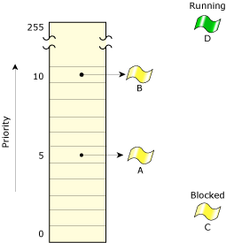
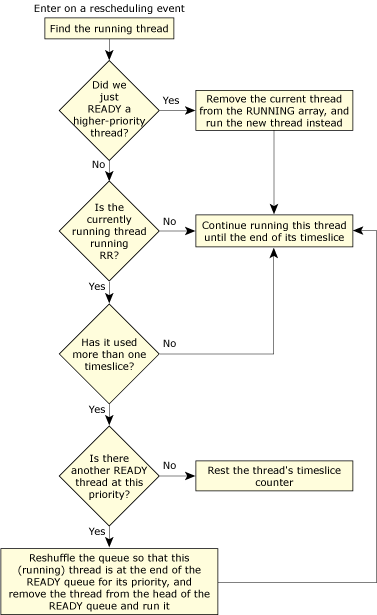
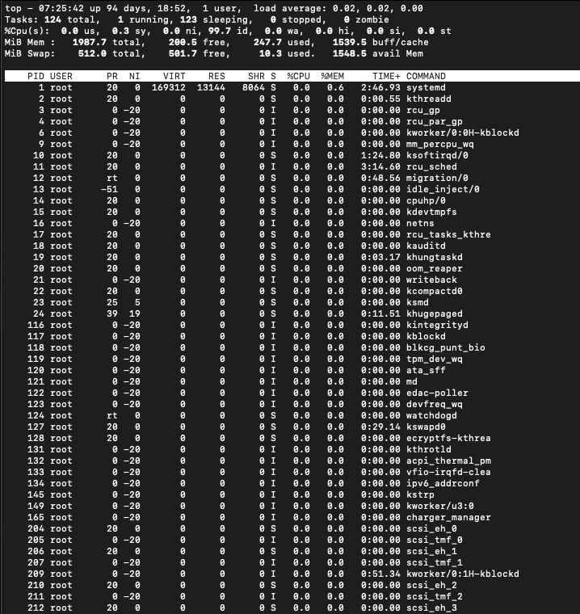
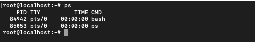
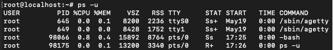
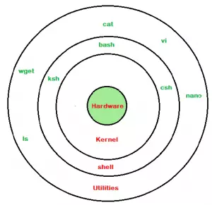

# my-linux-learning

Đây là repository dùng để ghi chú lại các thông tin quan trọng trong quá trình học và sử dụng hệ điều hành Linux của mình.

## Table of Contents


<details>
<summary>
<b>Module 1 - Understanding Linux Concepts</b>
</summary>

1. **[Unix vs Linux](module-01/unix-vs-linux.md)**

2. **[Hard disk](module-01/hard-disk.md)**

3. **[Disk cache](module-01/disk-cache.md)**

4. **[Inside Linux](module-01/inside-linux.md)**

5. **[Operating System](module-01/operating-system.md)**

6. **[Various Parts of an Operating System](module-01/various-parts-of-os.md)**

7. **[Important parts of Kernel](module-01/important-parts-of-kernel.md)**

8. **[Virtual Memory](module-01/virtual-memory.md)**

</details>

<details>
<summary>
<b>Module 2 - Install VMWare</b>
</summary>

*Chưa có gì phải ghi chú ở đây*
</details>

<details>
<summary>
<b>Module 3 - System Access And File System</b>
</summary>

1. **[Something that need to remember](module-03/important-things-to-remember.md)**

2. **[Linux File System](module-03/linux-file-system.md)**

3. **[File System Structure and its Description](module-03/file-system-structure.md)**

4. **[Navigating File System](module-03/navigating-file-system.md)**

5. **[What is root](module-03/what-is-root.md)**

6. **[Creating files, file types](module-03/creating-files-directories.md)**

7. **[Find files](module-03/find-files.md)**

8. **[WildCards](module-03/wild-cards.md)**

9. **[Soft and hard links in details](module-03/soft-and-hard-links-in-details.md)**

</details>

<details>
<summary>
<b>Module 4 - Linux Fundamentals</b>
</summary>

- <details>
  <summary>
  <b>Linux Command Syntax</b>
  </summary>

  Syntax cơ bản của một command là:
  `command` `option` `agrument`
  
  **Options**:
  Thay đổi cách mà command hoạt động.

  Thường bao gồm dấu gach ngang `-` ở phía trước.

  Một số command chấp nhận nhiều options và cho phép group nhiều option đó lại với nhau sau dấu `-`.

  **Agrument**:
  Hầu hết các command đều được sử dụng cùng với một hoặc nhiều tham số.
  
  Một số command sẽ mặc định sử dụng một `default agrument` nếu không được chỉ định rõ.
  
  Tham số có thể là tùy chọn hoặc bắt buộc, tùy thuộc vào command.
  </details>

- <details>
  <summary>
  <b>Access Permission (In Details)</b>
  </summary>

  **Giới thiệu về quyền truy xuất**:
  Quyền là thuộc tính của một tệp và thư mục. Nó cho biết từng đối tượng người dùng (chủ sở hữu, người cùng nhóm, người dùng khác) có quyền gì trên một tệp và thư mục. Linux sử dụng 9 bit cho việc này, trong đó 3 bit đầu cho biết quyền đọc, ghi, thực thi của owner, 3 bit tiếp theo cho biết quyền của group, 3 bit cuối cho biết quyền của other. Trong các lệnh, 3 bit xác định quyền cho một đối tượng người dùng được biểu diễn bằng một số nguyên (có giá trị từ 0 đến 7), quyền được biểu diễn bằng ba số nguyên liên tiếp.

  | Number | Permission Type | Symbol |
  |:------:|:---------------:|:------:|
  | 0 | No Permission | - |
  | 1 | Execute | --x |
  | 2 | Write | -w- |
  | 3 | Execute + Write | -wx |
  | 4 | Read | r-- |
  | 5 | Read + Execute | r-x |
  | 6 | Read + Write | rw- |
  | 7 | Read + Write + Execute | rwx |

  **Quyền cho tệp và thư mục được tạo mới**:
  Với các tệp và thư mục được tạo mới, quyền được xác định dựa trên quyền cơ sở (base permission) và user mask.
  
  Base permission được thiết lập sẵn và không thể thay đổi.

  - Đối với file thông thường thì BS là 666 (`rw-rw-rw`)
  - Đối với thư mục (file đặc biệt) thì BS là 777 (`rwxrwxrwx`)

  Có thể tính nhanh quyền truy xuất tệp và thư mục theo các công thức sau:

  ```
  Quyền truy cập file = 666 - unmask
  Quyền truy cập folder = 777 - unmask
  ```

  Giá trị user mask mặc định cho người dùng thông thường là **002**

  Với mask này thì quyền hạn truy cập mặc định cho thư mục là **775** và file là **664**

  Giá trị mask mặc định cho root là **022**

  Với mask này thì quyền hạn truy cập mặc định cho thư mục là **755** và file là **644**

  Sử dụng chương trình **umask** để thay đổi user mask. **Các tệp và thư mục được tạo ra sau lệnh umask sẽ chịu tác động của giá trị mask mới**.

  **Thay đổi quyền của tệp và thư mục đã tồn tại**:

  Có thể sử dụng chương trình **umask** để thay đổi user mask, sau đó dùng chương trình touch để cập nhật quyền của tệp theo user mask mới . Dưới đây là một ví dụ minh họa việc giá trị user mask quyết định các quyền hạn trên file.txt như thế nào.

  ```sh
  unmask 077
  touch test_file.txt
  ls-l test_file.txt

  > -rw------ 1 uit uit 0 2024-08-20 11:10 test_file.txt
  ```

  Note: *Cơ chế làm việc của umask khiến chúng ta không thể tạo ra các file với quyền execute. Vì Base permission của file luôn là 666, tức các bit ứng với quyền execute đều bằng 0, nên bất kể giá trị mask bằng bao nhiêu thì quyền của file đều không có execute.*

  Cách khác để thay đổi quyền của tệp và thư mục đã tồn tại là sử dụng chmod. Sử dụng chmod có thể thêm quyền thực thi cho tệp và thư mục.

  `chmod [OPTION] MODE FILE`

  trong đó:
  - OPTION hay được dùng nhất là -R hoặc --recursive (đệ quy) khi muốn áp dụng quyền cho tất cả tệp và các thư mục con.
  - MODE cho biết đối tượng người dùng nào (u: user sở hữu; g: group; o: other, a: all) được cấp/thu hồi/gán (+-=) quyền gì (rwxXst hoặc [0-7]+)
  - File là file hoặc folder bạn muốn thay đổi quyền

  **Thay đổi chủ sở hữu của tệp và thư muc**
  Người tạo ra tệp hay thư mục là chủ sở hữu (owner) mặc định của tệp hay thư mục. Quyền sở hữu của tệp hay thư mục còn thuộc owning group. Owner hoặc root có thể thay đổi chủ sở hữu của tệp và thư mục bằng dùng chương trình chown.

  `chown [OPTION] [OWNER][:[GROUP]] FILE`
  
  **SUID, SGID, Sticky bit**
  Ngoài 9 bits cơ bản xác định các quyền rwx của owner, group và other, Linux sử dụng 3 bit khác để định nghĩa quyền trên tệp và thư mục. Các bit này lần lượt là SUID, SGID, Sticky. Trong các lệnh, một số nguyên nữa có giá trị từ 0 đến 7 được dùng để xác định ba quyền này. Ví dụ, trong lệnh

  ```sh
  chmod 6750 file1.txt
  ```
  số 6 (nhị phân là 110) **đầu tiên** trong quyền xác định SUID, SGID được bật, sticky không được bật.

  Ý nghĩa của ba bit SUID, SGID, Sticky được giải thích lần lượt như sau.

  **SUID (Set owner User ID up on execution)**
  Thông thường, khi một chương trình/tệp/lệnh chạy, nó sử dụng các quyền của người dùng hiện tại, hay người dùng chạy nó. Nếu SUID được đặt, chương trình sẽ sử dụng quyền của owner chứ không phải quyền của người dùng hiện tại. Ví dụ, owner của /etc/passwd, /etc/shadow là root. Người dùng thông thường không có quyền ghi các tệp này. Nếu các tệp này không được đặt quyền SUID, khi người dùng chạy lệnh passwd sẽ xuất hiện lỗi do không mở và ghi vào tệp /etc/shadow được. Ngược lại, khi các tệp này được đặt quyền SUID, người dùng thông thường cũng có thể chạy lệnh passwd.

  Ví dụ:
  - Đặt quyền SUID của tệp cho người dùng hiện tại: `chmod u+s file1.txt` hoặc `chmod 4750 file1.txt`
  - Bỏ quyền SUID của tệp đối với người dùng hiện tại: `chmod u-x file1.txt`

  Khi SUID được bật, bit x của owner được hiển thị là s nếu owner có quyền thực thi . Nếu owner không có quyền thực thi, bit x của owner được hiển thị là S. Ví dụ, -rwSrw-r-- có nghĩa là bit SUID đã được bật nhưng bit x của owner không được bật, -rwsrw-r-- có nghĩa là bit SUID đã được bật và bit x của owner được bật, rwxrw-r-- nghĩa là bit SUID không được bật và owner có quyền thực thi.

  **SGID (Set Group ID up on execution)**
  Tương tự SUID, nhưng thay owner là group. Nếu SGID được đặt, chương trình sẽ sử dụng quyền của group, chứ không phải quyền của người dùng hiện tại.

  Ví dụ:
  - Đặt quyền SGID cho tệp `chmod g+s file.txt` hoặc `chmod 2750 file.txt`

  Khi SGID được bật, bit x của group được hiển thị là s nếu group có quyền thực thi. Nếu group không có quyền thực thi, bit x của group được hiển thị là S. Ví dụ, -rwxrwSr-- có nghĩa là bit SGID đã được bật nhưng bit x của group không được bật, -rwxrwsr-- có nghĩa là bit SGID đã được bật và bit x của group được bật, rwxrwxr-- nghĩa là bit SGID không được bật và owner có quyền thực thi.
  
  **Sticky bit**
  Sticky bit áp dụng cho thư mục. Nếu bit này được bật, chỉ owner và root có thể xóa nội dung của thư mục. Sử dụng bit này để thiết lập cấu hình ngăn người dùng xóa dữ liệu của người khác.

  Ví dụ:
  - Bật sticky bit trên thư mục /important: `chmod o+t /important` hoặc `chmod +t /important` hoặc `chmod 1757 /important`
  - Tắt sticky bit trên thư mục /lab: `chmod o-t /lab`
  
  Khi sticky được bật, bit x của other được hiển thị là t nếu other có quyền thực thi. Nếu other không có quyền thực thi, bit x của other được hiển thị là T. Ví dụ, -rwxrw-r-T có nghĩa là sticky đã được bật nhưng bit x của other không được bật.

  </details>

- <details>
  <summary>
  <b>Access Control List (In Details)</b>
  </summary>

  ACLs là cách khác để xác định quyền trên tệp và thư mục. Chúng cho phép gán quyền cho một người dùng hoặc một nhóm bất kỳ, thậm chí không tương tác với owner hoặc owning group. ACLs hỗ trợ các hệ thống file `ReiserFS`, `Ext2`, `Ext3`, `JFS`, `XFS`. Một tệp hoặc thư mục có thể có nhiều ACL.

  Dùng ls -dl để kiểm tra quyền:
  
  ```sh
  $ ls -dl mydir/
  > drwxr-xr-x 2 quanta quanta 4096 2007-12-29 22:53 mydir/
  
  ```

  Kiểm tra trạng thái khởi đầu của ACL:
  
  ```sh
  $ getfacl mydir/
  # file: mydir
  # owner: quanta
  # group: quanta
  user::rwx
  group::r-x
  other::---
  ```
  
  Gán quyền đọc, ghi, thi hành cho user nqat0919 và group friends:

  ```sh
  $ setfacl -m user:nqat0919:rwx,group:friends:rwx mydir/
  ```

  Tùy chọn **-m** sẽ nhắc setfacl chỉnh sửa một ACL đã tồn tại.

  Xem lại ACL với lệnh **getfacl**:

  ```sh
  $ getfacl mydir/
  # file: mydir
  # owner: quanta
  # group: quanta
  user::rwx
  user:nqat0919:rwx
  group::r-x
  group:friends:rwx
  mask::rwx
  other::---
  ```

  Ngoài các mục (entries) cho user nqat0919 và group friends, mask entry cũng được tạo ra. mask định nghĩa quyền truy cập có hiệu lực lớn nhất cho tất cả các entries của group.

  Bây giờ thử dùng chmod để bỏ quyền write của group, output của lệnh ls cho thấy mask bits đã được điều chỉnh với chmod:

  ```sh
  $ sudo chmod g-w mydir/
  $ getfacl mydir/
  # file: mydir
  # owner: quanta
  # group: quanta
  user::rwx
  user:nqat0919:rwx                  #effective:r-x
  group::r-x
  group:friends:rwx               #effective:r-x
  mask::r-x
  other::---
  ```

  Default ACLs Default ACL ảnh hưởng đến các thư mục con cũng như là các files. Nói cách khác, các thư mục con và tệp kế thừa default ACL của thư mục cha.

  Ví dụ thực tế:

  Giả sử /public là thư mục dùng chung cho mọi người trong công ty, hãy thiết lập để sao cho bất kỳ ai thuộc bất kỳ nhóm nào cũng có khả năng đọc file va chuyển vào trong thư mục này nhưng chỉ có người dùng trong nhóm quantri mới có thể ghi vào các file trong thư mục này.

  ```sh
  setfacl -d --set u::rx,g::rx,o::rx,g:quantri:rwx,m:rwx /pulbic
  getfacl /public
  ```
  </details>

- <details>
  <summary>
  <b>Pipe in Linux (In details)</b>
  </summary>

  **Mở đầu**
  Trong **Linux**, các thao tác chủ yếu và thường xuyên của người sử dụng là việc gõ các dòng lệnh trên một cửa sổ Terminal. Mỗi câu lệnh của Linux thường sẽ bao gồm đầu vào input và đầu ra output, ngoài ra phần lớn câu lệnh cũng đi kèm theo các thông báo lỗi. Nguyên lí thiết kế của các chương trình trong linux là chỉ làm một nhiệm vụ và làm nhiệm vụ đó tốt nhất có thể. Tuy nhiên các công việc của người sử dụng lại không chỉ đơn giản là sử dụng một câu lệnh duy nhất mà cần nhiều chương trình phối hợp với nhau để cùng thực hiện. Điều này thể hiện ở việc đầu ra của chương trình này lại là đầu vào của chương trình khác. Và như vậy theo cách thông thường chúng ta thường sẽ chạy từng câu lệnh riêng biệt, và lấy đầu ra của câu lệnh này làm đầu vào của câu lệnh kia, việc này mất rất nhiều vì đầu ra của các chương trình thường rất dài và phức tạp. Trong Linux, có một tính năng giúp người dùng sử dụng có thể giảm tải lượng công việc quá mất thời gian công sức này, đó là Piping - tính năng giúp chuyển hướng dòng thực thi của câu lệnh.

  **Cơ bản về Piping**
  Về cơ bản piping là một dạng chuyển hướng được sử dụng trong các dòng hệ điều hành Linux dùng để chuyển đầu ra của chương trình cho chương trinh khác làm đầu vào để xử lí tiếp. Theo ý nghĩa, **piping** là một đường ống, tức là nó sẽ làm cho các câu lệnh trở thành một dòng xử lý nối tiếp nhau và liên tục, kết nối trực tiếp và tạm thời hai hoặc nhiều chương trình đơn giản thành một nhóm các chương trình phức tạp. Chính nhờ vậy mà một số nhiệm vụ có thể hoàn thành với hiệu suất cao mà không một chương trình riêng lẻ nào có thể thực hiện một mình được. Việc kết nối chương trình thông qua **piping** giúp cho các chương trình có thể hoạt động liên tục chứ không phải chờ dữ liệu từ các nơi lưu trữ tạm thời như tệp tin hoặc màn hình hiển thị, cũng không phải chờ cho chương trình trước đó hoàn thành mà có thể hoạt động ngay khi chương trình trước nó bắt đầu tạo dữ liệu đầu ra.

  **Luồng dữ liệu**
  Các chương trình trong Linux được kế tnối với 3 luồng dữ liệu khi chúng được thực thi:
  - **stdin** (standard input): là luồng sẽ đưa dữ liệu vào chương trình để xử lí.
  - **stdout** (standard output): luồng này dùng để truy xuất dữ liệu ra màn hình hiển thị sau quá trình thực thi hoàn tất mà không gặp lỗi.
  - **stderr** (standard error): luồng này có chức năng tương tự như **stdout**, tuy nhiên nó chỉ dùng để in các thông báo lỗi và đồng thời khi đó tín hiệu lỗi cũng được gửi
  
  

  Ngoài ra, tùy theo chương trình mà luồng **stdout** có thể là tệp tin hoặc máy in...

  Việc liên kết các chương trình sẽ là việc đưa dữ liệu đầu vào chương trình trước đó đến thẳng đầu vào của chương trình sau mà không gặp dữ liệu được in ra màn hình hiển thị hoặc file.

  **Các dạng chuyển hướng**
  - **Chuyển hướng tới file**:
    - Là một trong 2 cách chuyển hướng đơn giản nhất, với cách này dữ liệu đầu ra sẽ được lưu vào file thay vì in ra màn hình hiển thị.
    - Để chuyển hướng 1 câu lệnh đến file, Linux cung cấp cho người dùntg sử dụng 2 cú pháp `<` (ghi nội dung ra file từ điểm bắt đầu, nếu file đã fcó nội dung thì ghi đè) và `<<` (tương tự `<` nhưng thay vì ghi đè nội dung cũ thì ghi từ điểm kết thúc của nội dung cũ).
  
    > Ghi nội dung ra file, nếu file không tồn tại thì file mới sẽ được tạo
    
    ```sh
    echo 'Hello World' > newfile.txt
    cat newfile.txt
    > Hello World
    ```
  - **Chuyển hướng từ file**:
    - Là cách chuyển hướng đơn giản còn lại, đi cùng với **Chuyển hướng tới file**, cách này giống với việc đọc dữ liệu từ file và sử dụng đó làm đầu vào cho chương trình.
    - Chỉ có một kí hiệu duy nhất cho cách này là `<` (Không có `>`)

    > Trong ví dụ này, nội dung của file được dùng làm đầu vào cho câu lệnh `wc`, có thể thấy rõ sự khác biệt của lần thực thi. Lần 1 thì đầu vào là 1 file, lần 2 thì đầu vào chỉ là nội dung của file (output của `wc` không còn tên file nữa)

    ```sh
    wc old_file
    > 2 5 32  old_file
    wc < old_file
    > 2 5 32
    ```
  - **Chuyển hướng đến stderr**:
    - Thông thường khi một câu lệnh gặp lỗi, thông tin lỗi sẽ hiển thị luôn trên màn hình cùng với các dữ liệu đầu ra.
    - Linux cung cấp kí hiệu `2>` để đưa nội dung thông báo lỗi ra file thay vì màn hình hiển thị.
  
  - **Chuyển hướng tối câu lệnh khác**:
    - SỰ chuyển hướng đặc biệt nhất, chuyển hướng **stdout** của một câu lệnh thành một **stdin** của câu lệnh tiếp theo
    - Sử dụng kí hiệu `|` để chuyển hướng

    > Ví dụ:

    ```sh
    printf 'Line1\nLine2\n' | wc -l
    > 2
    ```

  </details>

- <details>
  <summary>
  <b>Filtering In Linux</b>
  </summary>

  **Áp dụng kỹ thuật piping trong khi filtering**

  Do các câu lệnh trong Linux thường chỉ đảm nhiệm một công việc nhất định, nên có một số trường hợp ta cần kết hợp nhiều câu lệnh mới hoàn thành được công việc. Chính vì vậy, khi filtering ta có thể sử dụng kỹ thuật piping để các câu lệnh có thể liên kết với nhau dễ dàng hơn.

  **Các câu lệnh dùng để filtering**
  Dưới đây liệt kê một số câu lệnh thường được sử dụng nhiều nhất cho kỹ thuật `Filtering` trong **Linux**.

  **Câu lệnh _cat_ và _tac_**
  
  Mặc dù không có tác dụng là lọc dữ liệu, nhưng đây là 2 câu lệnh cực kì hữu hiệu để lấy dữ liệu từ file, phục vụ cho việc đọc dữ liệu. Nội dung của file có thể được in ra màn hình mà không cần phải mở file bằng bất cứ một trình soạn thảo văn bản nào. Điểm khác biệt là `cat` sẽ in file từ dòng đầu tiến dòng cuối cùng, còn `tac` sẽ in theo thứ tự ngược lại với `cat`.

  (Với `cat` khi dùng `-n` thì sẽ in kèm theo cả số dòng).

  >Hai lệnh `cat` và `tac` chỉ đơn giản là in cho ta nội dung của file

  **Câu lệnh _head_ và _tail_**
  
  Hai câu lệnh này tương tư như nhau về cách sử dụng, chỉ có khác nhau một điều là `head` lọc dữ liệu từ trên xuống còn `tail` thì lọc từ dưới lên. Mặc định 2 câu lệnh này đều lấy 10 dòng dữ liệu, hoặc có thể chỉ định số dòng muốn lấy bằng tùy chọn `-n`.

  Với việc kết hợp `head` cùng với `tail` thông qua `piping`, dữ liệu được sử dụng cho câu lệnh sau sẽ được lấy thông qua câu lệnh trước. như vậy nếu dùng câu lệnh `cat .bashsrc | head -n 7 | tail -n 2 ` thì kết quả cuối cùng sẽ là 2 dòng 6 và 7 của file `.bashrc`. Với việc dùng `-c` thay cho `-n`, đơn vị tính sẽ chuyển về số byte kí tự thay vì số dòng.

  >`head` và `tail` sẽ được dùng khi chúng ta có số lượng dữ liệu với rất nhiều dòng nhưng lại chỉ muốn lấy một số dòng cụ thể và liên tiếp nhau
  
  **Lệnh _sort_ và _uniq_**
  
  Lệnh sort có tác dụng sắp xếp các dòng dữ liệu theo một thứ tự nhất định (mặc định sẽ sắp xếp theo thứ tự bảng chữ cái). Lệnh `uniq` thường dùng chung với `sort`, có tác dụng loại bỏ các kết quả trùng lặp sau khi sắp xếp.

  >`sort` và `uniq` có tác dụng giúp cho việc kiểm kê các dạng dữ liệu tương tự nhau được dễ dàng hơn.

  **Lệnh cut**
  Thay vì lấy các dòng dữ liệu như `head` và `tail`, `cut` có tác dụng để lấy các cột dữ liệu (thường là dữ liệu dạng bảng)
  - Tùy chọn `-f` để chỉ định thự tự của cột sẽ lấy (mặc định sẽ lấy tất cả các cột)
  - Tùy chọn `-d` để định nghĩa separator (mặc định sẽ dùng ký tự TAB)
  
  ```bash
  cat file_test
  id name
  1 apple
  2 orange
  3 watermelon
  4 mango
  cat file_test | tail -n 4 | cut -f 2 -d ' '
  apple
  orange
  watermelon
  mango
  ```

  Có thể lấy nhiều cột như ví dụ sau:

  ```bash
  cat file_test
  id name amount
  1 apple 6
  2 orange 7
  3 watermelon 8
  4 mango 9
  cat file_test | tail -n 4 | cut -f 2,3 -d ' '
  apple 6
  orange 7
  watermelon 8
  mango 9
  ```

  >`cut` là lệnh cực kỳ hữu ích trong trường hợp thao tác với dữ liệu dạng bảng

  **Lệnh _less_ và _more_**
  Trong trường hợp cần phải đọc toàn bộ dữ liệu từ một file nhưng lại không muốn mở file đó lên bằng một trình soạn thảo nào đó, ta có thể sử dụng lệnh `less` hoặc `more` để phân trang file cần đọc. Điểm khác biệt giữa `less` và `more` là `less` cho phép cuộn ngược lên trang dữ liệu đã đọc, còn `more` thì chỉ có thể đọc từ đầu đến cuối. Có một cách khác khi đọc dữ liệu kiểu này là có thể dùng lệnh cat để in toàn bộ dữ liệu ra màn hình, tuy nhiên trong môi trường **console** nếu không hỗ trợ scrolll bar thì không thể xem hết được nội dung file nếu file quá dài.

  >`less` và `more` thường được dùng để phân trang dữ liệu

  **Lệnh _grep_**

  Lệnh này có tác dụng tìm kiếm trong file stream các dòng dữ liệu có chứa một cụm từ cụ thể.
  - Tùy chọn `-v` sẽ đảo ngược kết quả tìm kiếm, dữ liệu sẽ là các dòng không chứa cụm từ nhập vào.
  - Tùy chọn `-c` sẽ đếm số dòng xuất hiện của cụm từ truyền vào.
  - Tùy chọn `-l` sẽ tìm kiếm mà không phân biệt chữ hoa và chữ thường.

  > Lệnh `grep` thường được dùng cho công việc tìm kiếm dữ liệu từ file
  </details>

</details>

<details>
<summary>
<b>Module 5 - System Adminstration</b>
</summary>

- <details>
  <summary>
  <b>User & Group Management (In details)</b>
  </summary>

  Có 3 kiểu tài khoản trong hệ thống Linux:

  - **Tài khoản gốc (root account)**: Còn được gọi là superuser và sẽ có sự điều khiển tuyệt đối tới hệ thống. Một superuser có thể chạy bất cứ lệnh nào mà không bị hạn chế. Nguòi sử dụng này có thể được ví như một người quản lí hệ thống cấp cao nhất.
  - **Các tài khoản hệ thống**: Các tài khoản được cần cho các hoạt động riêng trong hệ thống như tài khoản mail và các tài khảon sshd. Những tài khoản này thường đuợc cần cho một số chức năng riêng trên hệ thống, và bất cứ sự chỉnh sửa nào tới với chúng có thể ảnh hưởng bất lợi tới hệ thống.
  - **Các tài khoản người dùng cá nhân**: Các tài khoản này cung cấp sự truy cập mang tính tương tác tới hệ thống với người dùng và nhóm sử dụng và thường bị giới hạn truy cập vào những file và thư mục có tính chất quan trọng.
  
  Unix hỗ trợ một khái nhiệm là tài khoản nhóm Group Account mà tạo nhóm một số tài khoản một cách logic. Mỗi tài khoản sẽ là một phần của bất kì tài khoản nhóm nào. Nhóm torng Unix đóng vai trò quan trọng trong việc thực hiện sự quản lý về tiến trình và cho phép tới file.

  ### Quản lý người và nhóm sử dụng trong Unix/Linux
  Có 4 file chínhq quản lý người sử dụng:

  - `/etc/passwd`: Giữ tài khoản người dùng và thông tin mật khẩu. File này giữ các thông tin quan trọng về các tài khoản trên hệ thống Linux.
  - `/etc/shadow`: Giữ mật khẩu được biên thành mật mã của tài khoản tương ứng. Không phải tất cả hệ thống đều hỗ trợ file này.
  - `/etc/group`: File này giữ thông tin nhóm cho mỗi tài khoản.
  - `/etc/gshadow`: File này giữ các thông tin tài khoản nhóm bảo mật.

  Bạn có thể kiểm tra các file trên với lệnh cat.

  Dưới đây là các lệnh có trong phần lớn hệ thống Unix để tạo và quản lý tài khoản cá nhân và nhóm:

  | lệnh | Miêu tả |
  |:----:|:-------:|
  |useradd|Thêm cádc tài khoản cá nhân tới hệ thống.|
  |usermod|Chỉnh sửa các thuộc tính của tài khoản cá nhân.|
  |userdel|Xóa các tài khoản cá nhân từ hệ thống.|
  |groupadd|Thêm các tài khoản nhóm tới hệ thống.|
  |groupmod|Chỉnh sửa các thuộc tính của tài khoản nhóm.|
  |groupdel|Dỡ bỏ các tài khoản nhóm ra khỏi hệ thống.|

  ### Tạo User mới
  Lấy ví dụ Alex là người quản trị hệ thống, cần tạo một user account cho John, Lisa và Sarah. Alex thực hiện điều này bằng lệnh `useradd`. Ví dụ, để tạo tài khoản cho John, Alex thực thi lệnh cụ thể dưới đây:

  ```sh
  useradd -u 1002 -d /home/john -s /bin/bash john
  ```

  Câu lệnh trên tạo tài khoản cho John với uid (`-u`) là 1002, home directory (`-d`) là /home/john và set (`-s`) /bin/bash là shell mặc định cho tài khoản này.

  Tương tự, Alex sẽ tạo tài khoản cho Lisa và Sarah bằng các format như vậy.

  Alex sau đó có thể kiểm tra các tài khoản người dùng mới bằng lệnh `id`:

  ```sh
  id john
  ```

  Lệnh trên sẽ hiển thị thông tin userID và group member for người dùng "john".

  

  ### Các thuộc tính của một tài khoản người dùng

  - **Username**: Mỗi user được gán cho một username duy nhất có vai trò là định danh trong hệ thống Linux. Ví dụ user của John là "john".
  - **UUID (User ID) và GID (Group ID)**: Mỗi tài khoản người dùng đều được liên kết với một UUID và GID. UID là một con số được gán cho user. Trong khi đó GID là con số đại diện cho group mà user đó thuộc về. Ví dụ, UID của John có thể là `1002`, và group cá nhân GID của john cũng là `1002`.
  - **Home Directory**: Mỗi user có một thư mục home nơi mà các file và settings cá nhân của user đó được lưu trữ. John's home directory là **/home/john**.
  - **Default Shell**: Default shell xác định trình thông dịch lệnh sẽ được sử dụng khi mà một người dùng đăng nhập vào hệ thống. Nó xác định môi trường tương tác dành cho user đó. Trong trường hợp này, môi trường tương tác của John là **/bin/dash**, là một shell phổ biến trong Linux.
  - **Password**: Tài khoản người dùng yêu cầu mật khẩu để xác minh và đăng nhập vào hệ thống.
  - **Group**: Với tư cách là thành viên của nhóm nào đó có thể  xác định tài nguyên hệ thống nào mà người dùng có thể truy cập.

  Alex có thể xem thông tin người dùng trên hệ thống Linux bằng cách chạy lệnh `cat /etc/passwd`. Các thông tin người dùng sẽ được hiển thị dưới định dạng này:

  ```sh
  john:x:1002:1002:,,,:/home/john:/bin/bash
  ```

  Các trường tương ứng mà format trên thể hiện:
  - `john`: username.
  - `x`: chứa thông tin mật khẩu đã được mã hóa của user. Nó được thay thế bằng một kí tự 'x' để chỉ ra rằng mật khẩu đang được lưu trong `/etc/shadow` vì lí do bảo mật.
  - `1002`: UID - User ID.
  - `1002`: GID - Group ID.
  - `,,,`: Trường thông tin thêm của user này, kí hiệu này biểu hiện là khi user được tạo thì không có thêm thông tin thêm nào.
  - `/home/john`: Home Directory của user.
  - `/bin/bash`: Shell mặc định cho user account này.

  ### Xóa tài khoản người dùng
  Giả sử Lisa đã rời công ty, để xóa tài khoản người dùng của cô ấy cùng với các file liên quan, alex sẽ thực thi lệnh `usedel`. Ví dụ, để xóa tài khoản của Lisa, alex dùng:

  ```sh
  sudo userdel lisa
  ```

  Câu lệnh này sẽ xóa người dùng `lisa`, cùng với home directory và bất kì file hay thư mục nào được sở hữu bởi user lisa.

  ### Chỉnh sửa tài khoản người dùng
  Vì nhân sự trong công ty có sự thay đổi, đội ngũ IT có thể cần điều chỉnh lại các tài khoản người dùng.

  Ví dụ, John (developer) được thêm một số trách nhiệm khác trong công ty. Để ánh xạ thay đổi này, đỗị IT trong công ty có thể thay đổi quyền hạn người dùng của John bằng lệnh `usermod`. Hãy xem xét thêm các trường hợp sau:

  #### Điều chỉnh user group cho một người dùng
  Công ty tạo thêm một group gọi là `development` để quản lí truy cập vào các tài nguyên đang trong quá trình phát triển. Để thêm John vào nhóm `development`, lệnh sau có thể được sử dụng:

  ```bash
  sudo usermod -aG development john
  ```

  Lệnh trên thêm John vào nhóm `development` và trao cho anh ta các quyền truy cập cần thiết.

  #### Điều chỉnh default shell cho một người dùng
  Trong trường hợp mà John cần sử dụng một shell khác thay cho **/bin/bash**. Đội ngũ IT có thể thay đổi thông tin tài khoản của anh ấy, ví dụ, cần thay đổi shell mặc định của John sang **/bin/zsh**. Câu lệnh sau có thể được sử dụng:

  ```bash
  sudo usermod -s /bin/zsh john
  ```

  Câu lệnh trên sẽ cập nhật tài khoản của John và sử dụng shell **/bin/zsh** là shell mặc định của tài khoản này.

  Chúng ta có thể kiểm tra điều này bằng lệnh `cat /etc/passwd` lần nữa để thấy rằng shell của john đã thay đổi từ **bin/bash** sang **/bin/zsh**.

  ### Quản lý nhóm
  Quản lý nhóm một cách hiệu quả là rất cần thiết cho việc điều khiển được tài nguyên bên trong môi trường Linux của công ty. Hãy tìm hiểu xem đội ngũ IT có thê tạo và quản lí nhóm như thế nào.

  #### Tạo nhóm mới trong Linux
  Để tạo một nhóm mới, chẳng hạn như `marketing`, câu lệnh sau có thể được sử dụng:

  ```bash
  sudo groupadd marketing
  ```

  Câu lệnh trên tạo ra nhóm `marketing`, có thể được sử dụng để gán một số quyền hạn cụ thể đối với các tài nguyên liên quan đến marketing.

  Để xem thông tin về nhóm chúng ta vừa tạo ra, dùng lệnh `cat /etc/group`

  Câu lệnh này sẽ trả về tất cả các nhóm trên hệ thống Linux.

  #### Gán user vào một nhóm trong Linux
  Sau khi nhóm được tạo ra, các user khác có thể được thêm vào nhóm đó. Ví dụ, dể thêm Sarah (quản lý marketing) vào nhóm `marketing`, câu lệnh sau có thể được sử dụng:

  ```bash
  sudo usermod -aG marketing sarahsmith
  ```

  Câu lệnh này thêm Sarah vào nhóm `marketing`, cho phép cô truy cập vào các tài nguyên liên kết với nhóm đó.

  ### Quản lý mật khẩu
  Đảm bảo việc quản lí mật khẩu đủ mạnh mẽ là yêu cầu thiết yếu để duy trì tính bảo mật cho các tài khoản người dùng bên trong môi trường Linux của công ty. Hãy xem xét một số cách mà đội ngũ IT có thể làm để đảm bảo tính bảo mật của mật khẩu cũng như quản lí mật khẩu người dùng một cách có hiệu quả.

  **Cài đặt policy cho mật khẩu**: Đội ngũ IT có thể cài đặt một số yêu cầu đối với mật khẩu để tăng cường tính mạnh mẽ của nó, bao gồm yêu cầu về độ phức tạp, hạn sử dụng cho mật khẩu, tính năng khóa tài khoản vv... Các Policy này có thể được thiết lập trong file **/etc/login.defs***.

  **Thay đổi mật khẩu người dùng**: Người dùng nên được khuyến khích thay đổi mật khẩu của họ một cách định kì. Họ có thể sử dụng lệnh `passwd`.

  ### Xác minh người dùng
  Xác minh người dùng là một khía cạnh thiết yếu trong việc quản lí người dùng trong Linux, đảm bảo rằng chỉ có các người dùng được cấp quyền thì mới có thể truy cập vào hệ thống. Công ty có thể xây dựng nhiều cơ chế xác thực khác nhau để bảo mật môi trường Linux.

  #### Xác thực dựa vào mật khẩu
  Xác thực bằng mật khẩu là phương pháp phổ biến nhất.

  #### Xác thực bằng SSH Key
  Secure Shell (SSH) key là kiểu xác thực bảo mật hơn so với xác thực bằng mật khẩu. User sẽ generate ra một cặp public key và private key, public key sẽ được lưu trữ ở server còn private key sẽ được lưu trữ một cách bảo mật và an toàn trong thiết bị của user.

  Với kiểu xác thực SSH key, các user chẳng hạn như Lisa, là một quản trị viên hệ thống tại công ty, có thể được xác thực mà không cần phải nhập mật khẩu. Thay vào đó, server sẽ xác định danh tính user dựa vào việc sở hữu private key.

  Để cài đặt xác định SSH key cho Lisa, có thể thực hiện các bước sau:
  
  - Generate ra một cặp SSH key trên máy tính của Lisa bằng cách dùng lệnh `ssh-keygen`.
  - Copy public key vào file `/home/lisasmith/.ssh/authorized_keys` của server.
  - Cài đặt server cho phép xác thực bằng SSH Key.

  </details>

- <details>
  <summary>
  <b>Process and Threads (QNX Neutrino Terms)</b>
  </summary>

  ## Mở đầu
  Để có thể có cái nhìn rõ hơn về các section tiếp theo, chúng ta cần phải có cái nhìn bao quát nhất định về mối quan hệ giữa thread và process. Có rất nhiều blog trên mạng giải thích về vấn đề này, nhưng đa số trong đó đọc **không thể hiểu nổi** vì quá lí thuyết, đây là vấn đề khó khăn vì Threads và Process là các khái niệm về bản chất đã rất trừu trượng của hệ điều hành. May mắn là, có một [bài viết](https://www.qnx.com/developers/docs/6.4.1/neutrino/getting_started/s1_procs.html#Threads_and_processes) giải thích khá dễ hiểu hai khái niệm này, và Section này sẽ **dịch lại bài viết đó**.
  
  ## Process and Threads
  
  Trước khi chúng ta nói về threads, process, time slices, và tất cả các "khái niệm lập lịch" đẹp đẽ khác, thì trước tiên hãy thiết lập một ví dụ để ta có thể liên tưởng được.

  ### Process là một ngôi nhà
  
  Đầu tiên hãy đặt nền móng cho ví dụ liên tưởng của chúng ta đối với threads và process bằng cách sử dụng các vật thể gần gũi mà ta thấy mỗi ngày - một ngôi nhà.
  
  Một ngôi nhà thật sự chỉ là một cái container, với một số thuộc tính của nó (chẳng hạn như không gian diện tích, số lượng phòng ngủ hoặc tương tự).

  Nếu chúng ta nhìn nhận theo hướng này, một ngôi nhà thật sự **không chủ động làm** bất kì thứ gì - nó là một vật thể bị động. Đây thực sự là những gì định nghĩa nên một process, chúng ta sẽ sớm khám phá điều này.

  ### Các người sống trong nhà là các threads

  Những người sống bên trong ngôi nhà là cái **vật thể động** - họ sử dụng các phòng khác nhau, xem TV, nấu ăn, tắm rửa và tương tự như vậy. Chúng ta sẽ sớm thấy một threads hoạt động thực sự như thế nào.
  
  #### Single Thread

  Nếu bạn sống một mình, bạn sẽ biết điều này nghỉa là gì - bạn **biết rằng** bạn có thể **làm bất kì điều gì** mà bạn muốn tại **bất kì lúc nào**, bởi vì không ai khác sống trong nhà, nếu bạn muốn tắm, muốn bật stereo, nấu bữa tối - bất kì điều gì - bạn chỉ việc thực hiện nó.

  #### Multi Thread

  Mọi thứ thay đổi đáng kể khi bạn thêm một người khác vào ở trong nhà. Cho rằng bạn đã kết hôn, vậy nên vợ/chồng của bạn cũng chuyển vào sống chung với bạn. Lúc này bạn không thể cứ thế tiến thẳng vào nhà vệ sinh ở bất kì thời điểm nào nữa; bạn cần kiểm tra trước để chắc chắn rằng vợ/chồng bạn không có trong đó!

  Nếu hai người lớn có trách nhiệm sống chung trong một ngôi nhà, thì bạn có thể "nới lỏng" về việc bảo mật sự riêng tư - bạn biết rằng người lớn còn lại sẽ tôn trọng không gian của bạn, sẽ không cố đốt nhà bếp (cố ý!) và tương tự như vậy.

  Bây giờ, nếu có vài đứa trẻ xuất hiện và xới tung mọi thứ, mọi thứ sẽ trở nên thú vị.

  ### Quay trở lại process và threads

  Giống như việc một ngôi nhà sẽ tốn một diện tích nhất định, một process cũng sẽ chiếm dụng một vùng nhớ nhất định! Và giống như chủ nhà có thể thoải mái đi vào bất kì phòng nào trong nhà mà họ muốn, các thread của một process cũng có quyền truy cập chung vào trong vùng nhớ của process đó. Nếu thread cấp phát một cái gì đó (mẹ đi ra ngoài và mua trò chơi điện tử), tất cả các thread khác có quyền truy cập vào nó (bởi vì nó hiện hữu ở một không gian dùng chung - tức là nó đang ở trong nhà). Tương tự, nếu một process cấp phát một vùng nhớ mới, vùng nhớ này sẽ ngay lập tức khả dụng đối với tất cả các threads. Bí quyết ở đây là nhận biết được bộ nhớ có khả dụng cho tất cả các threads trong process hay không. Nếu có, thì bạn sẽ cần tất cả các thread truy cập **một cách đồng bộ hóa** vào đó. Còn nếu nó không khả dụng cho tất cả, cứ xem như nó chỉ khả dụng cho một thread cụ thể, trong trường hợp này, chúng ta có thể giả sử rằng không cần đồng bộ hóa cho vùng nhớ này, bởi vì thread sẽ không tự làm rối chính nó!

  Chúng ta đều biết trong cuộc sống hàng ngày, mọi thứ sẽ không đơn giản như vậy. Bây giờ chúng ta đã biết về một đặc tính cơ bản (tóm gọn: tất cả mọi thứ đều có thể chia sẻ), hãy xem xét một ví dụ khi mà mọi chuyện trở nên thú vị hơn một chút, và tại sao.

  Sơ đồ bên dưới show cho chúng ta cách mà chúng ta thể hiện các threads và process. Process là vòng tròn, thể hiện cho khái niệm "container" (vùng địa chỉ bộ nhớ), và ba đường ngoằn nghèo chính là các threads. Chúng ta sẽ còn thấy các sơ đồ tương tự thế này xuyên suốt cuốn sách.

  
  <hr>
  
  *process như là một container của các threads*

  ### Mutual Exclusion (Loại trừ tương hỗ)

  Nếu bạn muốn đi tắm, và có một người đang sử dụng phòng tắm, bản sẽ phải chờ. Vậy thread xử lí việc này như thế nào?

  Nó sẽ thực hiện một thứ gì đó gọi là **mutual exclusion** (*không dịch tiếng việt cho term này, vì tiếng anh sẽ dễ nhớ hơn*). Nó có khái niệm khá gần nghĩa với những gì mà chúng ta tưởng tượng khi nói đến nó - một số lượng các threads sẽ tự loại trừ lẫn nhau khi truy cập đến một tài nguyên cụ thể.

  Nếu bạn đang đi tắm, bạn sẽ muốn *loại trừ truy cập* vào phòng tắm. Để làm được điều này, bạn về cơ bản sẽ đi tới phòng tắm và khóa cửa từ bên trong. Bất kì ai cố gắng sử dụng phòng tắm sẽ bị chặn lại bởi khóa cửa. Và khi bạn xong, bạn mở khóa cửa, cho phép một ai khác truy cập vào.

  Đấy là những gì mà thread sẽ làm. Một thread sẽ sử dụng một object được gọi là *mutex* (viết tắt của **mut**ual **ex**clusion). Object này sẽ như là ổ khóa trên cửa - một khi thread sở hữu mutex locked, không một thread nào có thể lấy được mutex, cho tới khi chính chủ sở hữu trả nó lại (mở khóa). Giống như một cái khóa cửa, các thread đang chờ lấy mutex sẽ bị chặn lại.

  Một điểm tương đồng thú vị giữa mutex và khóa cửa là việc mutex thật sự chỉ là ổ khóa "khuyến nghị". Nếu một thread không thuân thủ việc sử dụng mutex, thì sự bảo vệ này sẽ trở nên vô dụng. Nếu xét đến ví dụ ngôi nhà của chúng ta, thì việc này giống như một người cố ý phá và xông vào phòng tắm thông qua một bức tường và bỏ qua sự hiện diện của cửa và ổ khóa.

  ### Priorities (Độ ưu tiên)

  Chuyện gì xảy ra nếu phòng tắm đang bị khóa và có một số lượng người đang chờ để được sử dụng nó ? Tất nhiên, tất cả mọi người sẽ đứng đợi ở bên ngoài, chờ cho bất kì ai đang ở trong phòng tắm đi ra ngoài. Câu hỏi thực sự là, "chuyện gì xảy ra tiếp theo khi cửa mở? Ai sẽ là người vào trong tiếp theo?"

  Bạn có thể sẽ suy luận rằng, sẽ là "công bằng" khi cho người chờ lâu nhất vào tiếp theo. Hoặc có thể sẽ là "công bằng" nếu cho người già nhất, hoặc cao nhất, hoặc quan trọng nhất ... Có rất nhiều cách để định nghĩa thế nào là "công bằng" trong trường hợp này.

  Chúng ta giải quyết vấn đề này với các threads thông qua hai yếu tố: *độ ưu tiên* và *thời gian chờ đợi*.

  Giả sử  hai người đi đến nhà tắm (đang khóa) cùng một lúc. Một trong hai đang bị áp lực về deadline (họ đã trễ trong một cuộc họp) trong khi đó người còn lại thì không. Chẳng phải sẽ có lý nếu chúng ta cho phép người đang gấp được vào trước? Well, tất nhiên là có. Câu hỏi quan trọng duy nhất ở đây là cách chúng ta quyết định ai là người quan trọng. Điều này có thể được thực hiện bằng cách gán một độ ưu tiên (hãy sử dụng một con số kiểu như - 1 là độ ưu tiên thấp nhất và 255 là độ ưu tiên cao nhất). Người đang chờ trong ngôi nhà và đang bị áp lực về deadline sẽ có *số ưu tiên cao hơn*, còn người còn lại sẽ có *số ưu tiên thấp hơn*.

  Điều tương tự xảy ra với threads. Một thread sẽ kế thừa thuật toán lập lịch từ thread parent của nó, nhưng có thể gọi hàm [pthread_setschedparam()](https://www.qnx.com/developers/docs/6.4.1/neutrino/lib_ref/p/pthread_setschedparam.html) để thay đổi chính sách lập lịch và mức độ ưu tiên của nó (nếu nó có quyền làm vậy).

  Nếu một lượng các thread đang chờ, và mutex đã unlocked, chúng ta sẽ đưa mutex cho thread đang chờ có độ ưu tiên cao nhất. Giả sử, bằng cách nào đó, cả hai người có *cùng một độ tiên*. Bây giờ chúng ta sẽ làm gì? Well, trong trường hợp đó, sẽ "công bằng" nếu cho phép người đã chờ lâu hơn được vào tiếp theo. Trong trường hợp có một danh sách các threads đang chờ, thì chúng ta sẽ xét *độ ưu tiên* trước tiên và tiếp là *thời gian chờ đợi*.

  Mutex chắc chắn không phải object đồng bộ hóa duy nhất mà chúng ta gặp phải. Hãy xem xét một vài đối tượng khác.

  ### Semaphores (Cờ hiệu)
  
  Hãy di chuyển từ phòng tắm đến nhà bếp, vì phòng tắm là địa điểm được xã hội chấp nhận để có nhiều người cùng một lúc. Trong nhà bếp, bạn có thể không muốn có *tất cả mọi ngườ* tại đó cùng một lúc. Thực tế, bạn có lẽ muốn giới hạn số lượng người có thể hiện hữu trong nhà bếp.

  Xem như, bạn không bao giờ muốn có trên hai người trong nhà bếp cùng một lúc. Bạn có thể thực hiện với mutex không? Với cách chúng ta đã định nghĩa phía trên thì không khả thi. Tại sao? Đây thực tế là một vấn đề rất thú vị cho ví dụ của chúng ta. Hãy phân tích nó ra thành các bước sau:

  #### Semaphore với count = 1

  Phòng tắm có thể có một trong hai tình huống, với hai trạng thái có thể đi đôi với nhau:

  - **Phòng tắm không khóa** và **Không có ai**.
  - **Phòng tắm khóa** và **Có người**.
  
  Còn lại không còn cách kết hợp nào khả thi - cửa không thể nào khóa nếu không có ai bên trong (chúng ta sẽ mở khóa như thế nào?), và cửa không thể mở khóa nếu một người đang ở trong phòng tắm (làm sao mà họ có được sự riêng tư nếu làm như vậy?). Đây là một ví dụ của việc semaphore với bộ đếm là một - có nhiều nhất một người trong phòng, hay một thread đang sử dụng semaphore.

  Mấu chốt ở đây là cách chúng ta mô tả ổ khóa. Với ổ khóa thông thường cho phòng tắm, bạn chỉ có thể mở khóa từ bên trong - không có một chìa khóa nào cho phép truy cập từ bên ngoài. Thực tế, điều này có nghĩa là việc sở hữu mutex là một thao tác *atomic* - *Không có khả năng* nào để mà khi bạn đang trong quá trình lấy mutex thì có một thread cũng lấy nó, dẫn đến việc cả hai đều có mutex. Trong ví dụ ngôi nhà của chúng ta, điều này ít rõ ràng hơn vì con người thông minh hơn rất nhiều so với các con số 0 và 1.

  Vì thế, thứ chúng ta cần cho nhà bếp sẽ là một loại ổ khóa khác.

  #### Semaphore với count > 1

  Giả sử bây giờ, chúng ta đã thiết lập *một ổ khóa có chìa* truyền thống cho nhà bếp. Cách hoạt động của ổ này là nếu bạn có chìa khóa, bạn có thể mở cửa và bước vào trong. Bất kì ai sử dụng ổ khóa này sẽ cam kết rằng, khi họ bước vào bên trong, họ sẽ ngay lập tức khóa cửa lại từ bên trong và vì thế bất kì ai bên ngoài bước vào sẽ luôn cần có chìa khóa.

  Well, bây giờ, vấn đề trở nên đơn giản là làm sao để quy định bao nhiều người chúng ta muốn có trong nhà bếp - treo hai cái chìa khóa bên ngoài cửa! Nhà bếp luôn luôn khóa! Khi một người muốn vào nhà bếp, họ sẽ thấy nếu có chìa khóa được treo ngoài đó. Như vậy, họ có thể sử dụng chìa này, mở cửa nhà bếp, đi vào và khóa cửa lại từ bên trong.

  Vì người vào trong bếp phải có chìa khóa, cho nên chúng ta kiểm soát một cách trực tiếp số lượng người được phép vào nhà bếp tại bất kì thời điểm nào bằng cách giới hạn số lượng chìa khóa được treo bên ngoài cửa.

  Với threads, điều này thực hiện thông qua một *semaphore*. Một semaphore "đơn thuần" thì sẽ hoạt động giống như mutex - hoặc là bạn sở hữu nó, nghĩa là bạn đã truy cập vào tài nguyên, hoặc là không sở hữu nó, nghĩa là bạn không truy cập. Semaphore mà chúng ta mô tả trong ví dụ nhà bếp là một *counting semaphore* - nó theo dõi số lượng (bằng số lượng chìa khóa khả dụng cho các threads).

  #### Một semaphore đóng vai trò như là một mutex

  Chúng ta vừa trả lời cho câu hỏi "Bạn có thể thực hiện nó với một mutex?" trong tình huống implement một ổ khóa với bộ đếm, và câu trả lời là không. Vậy còn tình huống ngược lại thì sao? Liệu chúng ta có thể sử dụng semaphore như một mutex?
  
  Có. Trong thực tế, trong một số hệ điều hành, đó chính xác là những gì chúng làm - chúng không có mutex, mà chỉ có semaphore! Vậy tại sao phải bận tâm đến mutex làm gì?

  Để trả lời câu hỏi này, nhìn vào ví dụ phòng vệ sinh. Làm thế nào mà người xây dựng ngôi nhà implement "mutex"? Tôi đoán rằng là do bạn không có chìa khóa để treo trên tường!

  Các mutex là **một dạng semaphore cho mục đích đặc biệt**. Nếu bạn muốn muốn chỉ có một thread được phép chạy trên một một phần code nào đó, mutex hiện tại vẫn là cách implement hiệu quả nhất.

  Tiếp theo, chúng ta sẽ tiếp tục xem xét các cơ chế đồng bộ hóa khác - gọi là *condvars*, *barriers* và *sleepons*.

  > Để không bị confuse, hãy nhìn vào việc một mutex có các thuộc tính khác, chẳng hạn như tính kế thừa, và điều này làm nó khác biệt so với một semaphore.

  ## Vai trò của Kernel
  
  Phép ẩn dụ về ngôi nhà thực sự rất tuyệt vời để truyền tải khái niệm về đồng bộ hóa, nhưng nó có một điểm hạn chế lớn. Trong ngôi nhà của chúng ta, có nhiều luồng (threads) chạy đồng thời. Tuy nhiên, trong một hệ thống thực tế, thường chỉ có một CPU, vì vậy chỉ có một "thứ" có thể chạy tại một thời điểm.

  ### Một CPU đơn lẻ

  Hãy xem xét những gì diễn ra ở thực tế, và đặc biệt là trong trường hợp "kinh tế" khi chúng ta chỉ có một CPU trong hệ thống. Trong trường hợp này, vì chỉ có một CPU hiện diện, chỉ có một thread có thể chạy ở bất kì thời điểm nào. Kernel sẽ quyết định (sử dụng một số luật, mà chúng ta sẽ xem xét sơ bộ) thread nào sẽ được chạy, và chạy nó.

  ### Nhiều CPU (SMP)

  Nếu bạn mua một hệ thống có nhiều CPU giống nhau, tất cả đều chia sẻ bộ nhớ và các thiết bị, bạn sẽ có một SMP (SMP viết tắt của Symmetrical Multi Processor, với "symmetrical" chỉ ra rằng tất cả các CPU trong hệ thống đều giống nhau). Trong trường hợp này, số lượng thread có thể chạy đồng thời bị giới hạn bởi số lượng CPU. (Thực tế, điều này cũng đúng với hệ thống có một CPU duy nhất!) Vì mỗi CPU chỉ có thể thực thi một thread tại một thời điểm, nên với nhiều CPU, nhiều thread có thể thực thi đồng thời.

  Hãy tạm thời bỏ qua số lượng CPU có trong hệ thống — một cách trừu tượng hữu ích là thiết kế hệ thống như thể nhiều thread thực sự đang chạy đồng thời, ngay cả khi điều đó không hoàn toàn chính xác. Trong phần ["Những điều cần lưu ý khi sử dụng SMP"](https://www.qnx.com/developers/docs/6.4.1/neutrino/getting_started/s1_procs.html#smpbeware), chúng ta sẽ thấy một số tác động không trực quan của SMP.

  ### Kernel như là một trọng tài

  Vậy ai là người quyết định thread nào sẽ được chạy tại một thời điểm? Đó là nhiệm vụ của kernel.

  Một kernel sẽ quyết định thread nào sẽ sử dụng CPU tại một thời điểm cụ thể, và *chuyển ngữ cảnh* (context) sang thread đó. Hãy phân tích Kernel làm gì với CPU.

  Một CPU có một số lượng các thanh ghi (số lượng chính xác dựa vào processor family). Khi một thread đang chạy, thông tin sẽ được lưu trữ vào các thanh ghi đó (chẳng hạn, vị trí của chương trình).

  Khi mà kernel quyết định một thread khác nên được chạy, nó sẽ cần:
  
  - Lưu lại các thanh ghi của thread đang chạy và các thông tin context khác.
  - Tải các thanh ghi của thread mới và context của thread đó vào CPU.
  
  Nhưng làm thế nào mà kernel quyết định rằng một thread nên chạy? Nó xem xét liệu một thread cụ thể có khả năng sử dụng CPU vào thời điểm hiện tại hay không. Ví dụ, khi chúng ta nói về mutex, chúng ta đã giới thiệu cơ chế blocking state (điều này xảy ra khi một thread sở hữu mutex và một thread khác cũng muốn lấy nó; thread thứ hai sẽ bị chặn).

  Theo cách nhìn nhận của kernel, vì thế, chúng ta có một thread *có thể* tiêu thụ CPU và một thread *không thể*, bởi vì nó bị block và đang chờ mutex. Trong trường hợp này, kernel sẽ để thread có thể chạy tiêu thụ CPU, và đặt list còn lại vào một danh sách nội bộ (nhờ đó kernel có thể theo dõi yêu cầu của nó đối với mutex).

  Rõ ràng đó không phải là một tình huống thú vị. Giả sử rằng có một số lượng các threads *có thể* sử dụng CPU. Nhớ rằng chúng ta ủy quyền việc truy cập vào mutex dựa vào **độ ưu tiên** và **thời gian chờ đợi**? Kernel sử dụng một cơ chế tương tự đễ quyết định xem thread nào sẽ được chạy tiếp theo. Có hai yếu tố: *độ ưu tiên* và *thuật toán lập lịch*, được đánh giá theo thứ tự đó.

  #### Độ ưu tiên

  Xem xét hai threads có khả năng sử dụng CPU. Nếu các threads này có độ ưu tiên khác nhau, thì câu trả lời khá đơn giản - kernel đưa CPU cho thread có độ ưu tiên cao hơn, như cái cách chúng ta đã nói đến trong trường hợp nhận mutex. Lưu ý là độ ưu tiên 0 được dự trù cho idle thread - bạn không thể sử dụng nó.

  Nếu một thread khác với độ ưu tiên cao hơn bỗng dưng có khả năng cần phải sử dụng CPU, kernel sẽ ngay lập tức context-switch đến thread có độ ưu tiên cao hơn. Chúng ta gọi cơ chế này là *preemption* (quyền ưu tiên) - thread có độ ưu tiên cao hơn sẽ chiếm quyền của thread có độ ưu tiên thấp hơn. Khi mà thread có quyền ưu tiên cao hơn hoàn thành, và kernel context thực hiện context-switch lại cho thread có độ ưu tiên thấp hơn đang chạy trước đó, chúng ta gọi cơ chế này là *resumption* (nối lại) - kernel tiếp tục chạy thread trước đó.

  Bây giờ, gải sử rằng hai thread có khả năng sử dụng CPU có cùng một độ ưu tiên.

  #### Thuật toán lập lịch

  Hãy giả sử rằng, một trong các thread đang sử dụng CPU. Chúng ta sẽ nghiên cứu các luật mà kernel sử dụng để quyết định context-switch trong trường hợp này. (Tất nhiên, toàn bộ quá trình này thật sự áp dụng cho các threads có cùng một độ ưu tiên - nếu *trong một khoảng khắc*, nếu mọt thread *có độ ưu tiên cao hơn*  sẵn sàng để sử dụng CPU, nó sẽ lấy nó; đấy là toàn bộ lí do cho việc có tính ưu tiên trong một hệ điều hành thời gian thực.)

  Hai thuật toán lập lịch (policies) mà Neutrino kernel có thể hiểu là Round Robin (hoặc "RR") và FIFO (First-In, First-Out).

  #### FIFO

  Trong thuật toán lập lịch FIFO, một thread được phép tiêu thụ CPU tronng thời gian mà nó muốn. Điều này có nghĩa là, nếu thread đang thực hiện một tác vụ tính toán toán học cực kì lâu, và không một thread nào khác có quyền cao hơn đang sẵn sàng, thì thread đó có khả năng sẽ *được phép chạy vĩnh viễn*. Vậy còn các threads khác có độ ưu tiên ngang bằng thì sao? Chúng cũng bị chặn luôn (tất nhiên bao gồm cả các thread có độ ưu tiên thấp hơn).

  Nếu thread đang chạy quits hoặc *tự nguyện từ bỏ CPU*. *thì* kernel sẽ tìm kiếm các thread có cùng độ ưu tiên mà có khả năng sẽ sử dụng CPU. Nếu không có thread nào như vcậy, *thì* kernel tìm kiếm các thread có độ ưu tiên thấp hơn có khả năng sử dụng CPU. Lưu ý rằng định nghĩa *tự nguyện từ bỏ CPU* có thể có hai nghĩa. Nếu thread vào trạng thái ngủ, hoặc bị chặn bởi một semaphore, tương tự vậy, thì tất nhiên, các thread có độ ưu tiên thấp hơn có thể chạy (như đã mô tả phía trên). Nhưng cũng có một lệnh gọi "đặc biệt", [sched_yeld()](https://www.qnx.com/developers/docs/6.4.1/neutrino/lib_ref/s/sched_yield.html) (*không cần thiết nhắc đến ở đây*) mà chỉ từ bỏ CPU cho các thread khác có cùng độ ưu tiên -  thread có độ ưu tiên thâp hơn sẽ không bao giờ có cơ hội được chạy nếu một thread có độ ưu tiên cao hơn sẵn sàng được chạy. Nếu một thread thực sự gọi [sched_yeld()](https://www.qnx.com/developers/docs/6.4.1/neutrino/lib_ref/s/sched_yield.html), và không có một thread nào có cùng độ ưu tiên đang sẵn sàng để chạy, thì thread gốc sẽ tiếp tục được chạy. Lời gọi [sched_yeld()](https://www.qnx.com/developers/docs/6.4.1/neutrino/lib_ref/s/sched_yield.html) thực tế được sử dụng để cho phép một thread khác có cùng độ ưu tiên bẻ khóa CPU.

  Ở sơ đồ phía dưới, chúng ta thấy có ba threads đang thực thi trong hai process khác nhau.

  
  <hr>

  *Ba threads đang chạy trong hai process khác nhau*

  Nếu chúng ta giả sử rằng thread "A" và "B" đang READY, và thread "C" đang bị block (có lẽ là đang chờ mutex), và có một thread D (không được hiển thị) đang được chạy, thì đây sẽ là một phần của hàng đợi READY mà Neutrino Kernel duy trì:
  <hr>

  
  <hr>

  *Hai threads trên hàng đợi READY, một bị block, một đang chạy*

  Sơ đồ này cho thấy hàng đợi READY nội bộ của kernel trông như thế nào, đây là thứ kernel sẽ dùng để lập lịch thread tiếp theo. Lưu ý rằng thread "C" không phải là một phần của hàng đợi, bởi vì nó bị block, và thread "D" cũng không nằm trên hàng đợi này vì nó *đang chạy*.

  #### Round Robin
  Thuật toán lập lịch RR giốntg hệt FIFO, *ngoại trừ việc* thread sẽ không chạy mãi mãi nếu có một thread khác có cùng độ ưu tiên. Nó chỉ chạy trong các khoảng thời gian (*timeslice*) mà hệ thống đã quy định sẵn bằng cách sử dụng các hàm [sched_rr_get_interval()](https://www.qnx.com/developers/docs/6.4.1/neutrino/lib_ref/s/sched_rr_get_interval.html). Timslice thuờng là 4 ms, nhưng nó thực ra là gấp 4 lần *ticksize*, thông số mà có thể được truy vấn hoặc cài đặt với [ClockPeriod()](https://www.qnx.com/developers/docs/6.4.1/neutrino/lib_ref/c/clockperiod.html).

  Những gì sẽ xảy ra là kernel bắt đầu một RR thread, và đánh dấu lại thời gian. Nếu RR Thread chạy được một lúc, thời gian dành cho nó sẽ hết (timeslice hết). Kernel sẽ kiểm tra xem nếu có một thread nào đó khác có cùng một độ ưu tiên đang ready. Nếu có, kernel sẽ chạy nó. Nếu không, kernel sẽ tiếp tục chạy RR thread (tức là kernel cấp cho thread này một timeslice khác).

  ##### Quy tắc
  
  Tóm tắt lại quy tắc lập lịch (cho một CPU đơn lẻ), theo thứ tự quan trọng:
  
  - Chỉ một thread chạy tại một thời điểm.
  - Thread có độ ưu tiên cao nhất sẽ chạy.
  - Thread sẽ chạy cho tới khi nó bị block hoặc exit.
  - Một RR thread sẽ chạy trong khoảng thời gian nhất định, và sau đó kernel sẽ tái lập lịch cho nó (nếu cần thiết).

  Sơ đồ bên dưới thể hiện các quyết định mà kernel sẽ thực hiện:

  

  Đối với hệ thống nhiều CPU, các luật cũng tương tự, ngoại trừ việc nhiều CPU sẽ có thể chạy nhiều thread đồng thời. Thứ tự các thread chạy (các threads nào sẽ chạy trên các CPUs) sẽ được xác định giống hệt với cách quyết định trên một CPU đơn lẻ - thread READY có độ ưu tiên cao nhất sẽ chạy trên một CPU. Khi xử lý các thread có độ ưu tiên thấp hơn hoặc đã chờ đợi lâu, kernel có thể linh hoạt trong việc lập lịch để tránh lãng phí tài nguyên, đặc biệt là bộ nhớ đệm (cache). Kernel sẽ cố gắng tối ưu hóa việc sử dụng bộ nhớ đệm bằng cách sắp xếp các thread sao cho dữ liệu mà các thread này cần đã sẵn có trong cache hoặc dễ dàng truy cập. Điều này giúp giảm thiểu việc cache miss (khi dữ liệu cần thiết không có trong cache) và tăng hiệu quả xử lý của CPU.

  ### Kernel states
  Chúng ta đã nói về "running", "ready" và "blocked" một cách lỏng lẻo - bây giờ hãy chính thức hóa các *thread states* này.

  #### RUNNING
  State RUNNING đơn giản có nghĩa là thread này bây giờ đang tiêu thụ CPU. Trong hệ thống SMP, sẽ có nhiều threads cùng chạy; trên hệ thống một processor đơn lẻ, sẽ có một thread đang chạy.

  #### READY
  READY state nghĩa là thread có thể chạy ngay bây giờ - ngoại trừ việc là nó không thể, bởi vì có một thread khác (có cùng hoặc có độ ưu tiên cao hơn) đang chạy. Nếu hai thread đều có khả năng sử dụng CPU, một thread có độ ưu tiên 10 và một thread có độ ưu tiên 7, thì thread có độ ưu là 10 sẽ RUNNING còn thread có độ ưu tiên 7 sẽ READY.

  #### Các trạng thái blocked
  Tại sao chúng ta gọi chung là là blocked state? Vấn đề là, không chỉ có *một* block state, mà có hơn hàng chục trạng thái blocking.

  Tại sao lại nhiều thế? Bởi vì Kernel cần theo dõi *tại sao* thread lại bị blocked.

  Chúng ta đã thấy hai blocking state - khi một thread bị block và đang chờ mutex, thread đó đang ở MUTEX state. Khi một thread đang bị block và chờ một semaphore, thì là SEM state. Những trạng thái này đơn giản sẽ giúp chỉ ra hàng đợi nào (và tài nguyên nào) mà thread đó đang bị block.

  Nếu có một số lượng nhất định các threads bị block bởi một mutex (hay nói cách khác là đang trong MUTEX state), chúng sẽ không được kernel quan tâm *cho đến khi* thread sở hữu mutex trả nó lại. Tại thời điểm đó, tất cả các thread đang blocked sẽ trở nên READY, và kerneel sẽ tiến hành tái lập lịch (nếu cần thiết).

  Tại sao là "nếu cần thiết?" Thread mà vừa trả lại mutex rất có thể vẫn có một số thứ khác cần phải làm *và* thread đó có độ ưu tiên cao hơn so với các thread đang chờ. Trong trường hợp này, chúng ta đến với luật thứ hai, "Thread có độ ưu tiên cao nhất sẽ chạy", nghĩa là thứ tự lập lịch không cần phải thay đổi - thread có độ ưu tiên cao vẫn tiếp tục chạy kể cả sau khi đã release mutex.

  ## Quay trở lại với Threads và Process
  Hãy cùng quay trở lại với thảo luận của chúng ta về process và threads trước đó, lần này là với góc nhìn trên một hệ thống thực tế. Sau đó, chúng ta sẽ xem xét về các lợi gọi hàm được sử dụng để xử lí cho threads và process.

  Chúng ta biết rằng một process có thể có một hoặc nhiều threads (Một process không có threads nào thì sẽ không thể *làm* bất cứ thứ gì - Không có ai ở nhà, vậy nên không có gì xảy ra). Hệ thống Neutrino có thể có một hoặc nhiều process. (Tương tự, một hệ thống không có process nào cũng không thể thực hiện bất kì thứ gì)

  Vậy những process và threads này sẽ làm gì? Cuối cùng, chúng cấu thành nên một *hệ thống* - tập hợp các threads và process để thực hiện một mục đích gì đó.

  Ở tầng cao nhất, thì một hệ thống là cấu thành nên từ nhiều process. Mỗi process chịu trách nhiệm cho việc cung cấp một dịch vụ nào đó - có thể là hệ thống tệp (filesystem), trình điều khiển hiển thị (display driver), mô-đun thu thập dữ liệu (data acquisition module), mô-đun điều khiển (control module), hoặc bất kỳ dịch vụ nào khác.

  Bên trong mỗi process, có thể có một số lượng nhất định các threads. Các số lượng này là khác nhau. Một người thiết kế *sử dụng một thread* có thể tạo nên *cùng một chức năng* với một người thiết kế khác *sử dụng năm thread*. Một số vấn đề có thể dễ dàng được giải quyết bằng cách sử dụng đa luồng (multi-threaded) và thực sự khá đơn giản để thực hiện, trong khi các process khác lại phù hợp hơn với việc sử dụng một luồng đơn (single-threaded) và rất khó để chuyển đổi sang đa luồng.

  ### Tại sao lại phải có nhiều process?
  Vậy tại sao không thể có một process với hàng triệu threads? Mặc dù một số hệ điều hành ép buộc chúng ta code theo cách đó, thì việc chia nhỏ công việc ra thành nhiều process có rất nhiều lợi ích về:

  - Tính tách rời và tính mô đun hóa
  - Khả năng bảo trì.
  - Độ tin cậy.

  Khả năng "chia nhỏ vấn đề" ra thành nhiều vấn đề độc lập là một khái niệm mạnh mẽ.
  </details>

- <details>
  <summary>
  <b>Process in Linux/Unix</b>
  </summary>

  ## Process trong Linux là gì?

  ### Định nghĩa sơ lược
  Một *process* có thể được hiểu là một chưong trình đang hoạt động. Nó là tập hợp các components khác nhau, bao gồm data nhận được từ file, input của người dùng, các lệnh của chương trình, vv... Trong Linux, một *process* được tạo ra khi mà một ứng dụng được khởi động, một chương trình chạy, hoặc là một dòng lệnh được thực hiện. Mỗi chương trình hoặc lệnh trong Linux chỉ tạo ra một process, nhưng một ứng dụng mặt khác lại có thể tạo ra nhiều process khác nhau để đáp ứng các task khác nhau. Trong hệ thống Linux, các process thường được tạo ra bằng cách fork ra từ một process đang tồn tại khác, hay còn được gọi là parent process.

  ### Các loại process trong Linux
  Có nhiều loại process trong Linux:
  
  #### 1. Parent và Child Process
  Một *child process* là một Linux process được tạo ra bởi một process khác được biết đến như **parent process**. Một child process có thể được tạo bằng hai cách. Cách đầu tiên là sử dụng **fork system call**, thường được sử dụng trong các hệ điều hành họ **Unix**, cách còn lại là spawn method, thường được dùng hơn trong các hệ điều hành **NT Kernel** như Microsoft Windows. Một process được xem là một parent process nếu nó tạo ra một hoặc nhiều child process (subprocess).

  #### 2. Zombie và Orphan Process
  Một **zombie process** là một Linux process đã kết thúc quá trình thực hiện của nó nhưng vẫn còn entry trong process table. Zombie process thườn được tạo ra khi mà child process thực hiện xong nhưng parent process vẫn chưa đọc được exit status của nó.

  Một **orphan process** là một process sẽ tiếp tục chạy kể cả khi process cha đã hoàn thành hoặc bị terminate. Một orphan process có thể là vô tình hoặc cố ý tạo ra.

  #### 3. Daemon process
  **Daemon process** là các process dưới nền liên quan đến hệ thống. Những process này thường chạy dưới quyền root và phục vụ yêu cầu của các process khác. Daemon process thường chạy dưới nền, chờ cho một event nhất định hoặc một task cụ thể xảy ra. Daemon process, không như process thông thường, không yêu cầu một terminal điều khiển để hoạt động. Điều này có nghĩa là chúng có thể tiếp tục chạy và thực hiện nhiệm vụ của mình mà không cần phải có sự tương tác trực tiếp từ người dùng hoặc môi trường điều khiển.

  ### Các lệnh thao tác process trong Linux
  #### 1.top
  Lệnh này được sử dụng để hiển thị ra toàn bộ Linux process đang chạy trong môi trường hoạt động.

  

  Lệnh top hiển thị danh sách các process đang chạy trong thời gian thực cùng với mức tiêu thụ memory và CPU của chúng. Dưới đây là phân tích output của chúng:
  - **PID**: ID được gán cho mỗi process.
  - **User**: Username của process owner.
  - **PR**: Độ ưu tiên được gán cho process trong việc lập lịch.
  - **NI**: giá trị 'nice' của một process.
  - **VIRT**: Lượng virtual memory được sử dụng bởi process.
  - **RES**: Lượng physical memory được sử dụng bởi process.
  - **S**: State của process.
  
    - 'D' = uninteruptible sleep
    - 'R' = running
    - 'S' = sleeping
    - 'T' = traced hoặc stopped
    - 'Z' = zombie
  
  - **%CPU**: Tỉ lệ tiêu thụ CPU.
  - **%MEM**: Tỉ lệ tiêu thụ RAM.
  - **TIME+**: Tổng CPU time đã được tiêu thụ bởi process.
  - **Command**: Lệnh được sử dụng để kích hoạt process.
  
  Chúng ta có thể dùng phím mũi tên lên/xuống để điều hướng lên xuống danh sách được hiển thị. Để thoát, bấm **q**. Để kill một process, highlight (chọn) process và bấm **k**.

  Một cách khác là sử dụng lệnh kill.

  #### 2. ps
  Lệnh *ps* được viết tắt cho *process status*. Hiển thị các process đang chạy, tuy nhiên không giống với lệnh top, output hiển thị không phải là realtime.

  

  - **PID**: Process ID.
  - **TTY**: Terminal Type.
  - **TIME**: Tổng thời gian chạy.
  - **CMD**: lệnh launch process.
  
  Để xem rõ hơn có thể sử dụng flag `-u`:

  

  Trong đó:
  - **%CPU**: hiệu năng tính toán mà process đang sử dụng.
  - **%MEM**: lượng bộ nhớ mà process đang chiếm dụng.
  - **STAT**: process state

  #### 3. kill
  Để dừng process, có thể sử dụng lệnh *kill*, lệnh này sẽ gửi một signal để dừng process.

  Có nhiều loại signal mà chúng ta có thể gửi. Tuy nhiên thường sử dụng nhất là 'kill -9' hay 'SIGKILL'.

  Có thể kiểm tra toàn bộ signal bằng lệnh: `kill -L`

  Signal mặc định để gửi là 15, nghĩa là **SIGTERM**. 

  Syntax của lệnh này là `kill [pid]`
  
  Cú pháp cũng hay dùng trong trường hợp không thể termninate process một cách bình thường:

  `kill -9 [pid]`

  #### 4. nice
  Dùng để thay đổi độ ưu tiên của một process. Trong Linux, chúng ta có thể cài đặt ưu tiên giữa các porocess. Giá trị ưu tiên của process được gọi là 'Niceless', Niceless có thể trong khoảng từ **-20** đến **19**. **0** là giá trị mặc định.

  Để bắt đầu một process và gán cho nó một độ ưu tiên thay cho giá trị mặc định, dùng:

  ```sh
  nice -n [value] [process_name]
  ```

  Để thay đổi giá trị nice của một process đang chạy:
  
  ```sh
  renice [value] -p 'PID'
  ```
  </details>

- <details>
  <summary>
  <b>Jobs and Job Control in Linux</b>
  </summary>

  ### Giới thiệu
  Trong hệ điều hành Linux, *job* nghĩa là một process đang chạy background hoặc foreground. *Job control* nghĩa là khả năng thao tác các process này, bao gồm đình chỉ, tiếp tục và terminate chúng. Điều này có thể có ích khi quản lí nhiều task hoặc cần debug một vấn đề gì đó đang xảy ra với process.

  *Job control* được thực hiện bởi shell, là giao diện command line cho phép người dùng tương tác với hệ điều hành. Shell nổi tiếng nhất trong Linux là **BASH**, nhưng bên cạnh đó cũng tồn tại một số shell khác nhất như **ZSH** hoặc **KSH**.

  ### Hiểu về process và jobs trong Linux
  Trong Linux, mọi chương trình đang chạy đều được xem là một process. một process có thể là một chương trình đơn lẻ hoặc là một phần của một chương trình lớn hơn.

  Mỗi process được gán cho một mã định danh độc nhất được gọi là **PID**. Mã này có thể dùng để đại diện cho process và thực hiện thao tác trên nó, chẳng hạn như đình chỉ hoặc terminate.

  Một job là một process *đang chạy background* hoặc *đang chạy foreground*. Foreground là các cửa sổ đang hoạt động bên trong terminal, trong khi đó background là bất kì process nào đang chạy mà không chiếm quyền điều khiển của terminal.

  Mặc định thì, khi chúng ta chạy một lệnh trong terminal, thì nó chạy ở foreground. Chúng ta có thể process đang chạy ở foreground vì nó hiển thị output và chúng ta không thể tương tác với terminal cho đến khi lệnh đó hoàn thành hẳn.

  Để chạy một process ở background, chúng ta có thể sử dụng kí hiệu *&* ở cuối câu lệnh.

  ```sh
  $ sleep 30 &
  [1] 12345
  ```

  Trong ví dụ trên, lệnh **sleep** khiến cho process ngủ 30s. Kí hiệu & khiến cho process chạy background và output **[1] 12345** chỉ ra rằng job number của nó là 1 với PID là 12345.

  ### Quản lí jobs với lệnh _fg_ và _bg_
  Lệnh **fg** (foreground) và **bg** (background) cho phép chúng ta di chuyển job sang foreground hoặc background.

  ```sh
  $ fg %1
  sleep 30
  ```

  Mang job của lệnh **sleep** phía trên, có job number là 1 lên foreground và hiển thị output của nó.

  Đễ gửi một foreground job xuống background, chúng ta có thể sử dụng lệnh **bg** theo sau là job number hoặc PID.

  ```sh
  $ sleep 30
  [1] 12345
  ^Z
  [1]+ Stopped      sleep 30
  $ bg %1
  [1]+ sleep 30 &
  ```

  Lệnh **sleep** đang chạy ở foreground thì bị đình chỉ bởi phím tắt **^Z**. Sau đó lệnh **bg** được dùng để tiếp tục job này ở dưới background.

  ### Đình chỉ hoặc Tiếp tục job trong Linux
  Lệnh **suspend** cho phép chúng ta dừng tạm thời một job, trong khi đó lệnh **kill** cho phép chúng ta terminated job đó.

  Để đình chỉ một job, chúng ta sử dụng **suspend** theo sau là job number hoặc PID.

  ```sh
  $ sleep 30 &
  [1] 12345
  $ suspend %1
  [1]+ Suspended
  ```

  Ví dụ trên đình chỉ lệnh **sleep**, có job number là 1. Job này sau đó có thể tiếp tục với lệnh **fg**.

  Để terminate job này, chúng ta có thể sử dụng lệnh **kill** theo sau đó là job number hoặc PID

  ```sh
  $ sleep 30 &
  [1] 12345
  $ kill %1
  ```
  </details>

</details>

<details>
<summary>
<b>Module 6 - Shell Scripting</b>
</summary>

- <details>
  <summary><b>What is the Linux Kernel?</b></summary>

  [Link bài viết gốc](https://www.redhat.com/en/topics/linux/what-is-the-linux-kernel)

  ### Tổng quan
  Linux Kernel là thành phân chính của một hệ điều hành Linux, và là giao diện (interface) chính nằm giữa phần cứng máy tính và process, nó chịu trách nhiệm giao tiếp với 2 bên và quản lí tài nguyên hệ thống một cách hiệu quả nhất có thể.

  Sở dĩ được gọi là *Kernel* (hạt nhân) vì - giống như là hạt nằm ở trong một cái vỏ cứng - nó tồn tại trong OS và điều khiển mọi chức năng trọng yếu của phần cứng, kể cả là của điện thoại, laptop, server hay bất kì loại máy tính nào khác.

  ### Kernel làm gì
  Một kernel có 4 nhiệm vụ:

  1. **Memory management**: Theo dõi xem bao nhiêu bộ nhớ đã được sử dụng vào việc gì, và ở đâu.
  2. **Process management**: Xác định xem process nào sẽ được sử dụng dụng CPU khi nào, bao lâu.
  3. **Device drivers**: Đóng vai trò trung gian / thông dịch viên giữa phần cứng và các process.
  4. **System calls and security**: Tiếp nhận các yêu cầu dịch vụ từ process.
   
  Kernel, nếu được implement đúng cách, sẽ vô hình đối với người dùng, chỉ hoạt động trong thế giới của riêng nó gọi là *không gian kernel*, là nơi mà nó sẽ cấp phát bộ nhớ và theo dõi cách tất cả mọi thứ được lưu trữ. Tất cả những gì mà người dùng sẽ nhìn thấy - như trình duyệt web và các tập tin - được xem là *không gian người dùng*. Những application này sẽ tương tác với kernel thông qua một system call interface (SCI).

  *Nghĩ như thế này*: Kernel là một trợ lí cá nhân rất bận rộn cho một người điều hành quyền lực (phần cứng). Và nhiệm vụ của trợ lí cá nhân là chuyển tiếp các tin nhắn và yêu cầu (từ process) từ các nhân viên và những người bên ngoài (người dùng) đến người điều hành, để biết rằng cái gì được lưu ở đâu (bộ nhớ), và xác định xem ai có quyền liên lạc với người điều hành vào lúc nào và trong bao lâu.

  ### Kernel làm gì bên trong OS
  Để đem kernel vào ngữ cảnh này, chúng ta có thể xem một OS Linux có 3 layer chính:

  - **Phần cứng**: Máy chủ vật lí - nằm cuối cùng hoặc là nền của hệ thống, tạo nên bởi bộ nhớ (RAM) và các bộ xử lí hay đơn vị xử lí trung tâm (CPU), cũng như là các thiết bị có input/output như *thiết bị lưu trữ*, *mạng* và *đồ họa*. CPU sẽ thực hiện việc tính toán và đọc từ/viết vào bộ nhớ.
  - **Linux Kernel**: Hạt nhân của OS (Nằm ở giữa). Nó là phần mềm nằm trong bộ nhớ mà sẽ cho biết CPU cần phải làm gì.
  - **User process**: Là các chương trình đang chạy sẽ được kernel quản lí. User process là những gì sẽ tạo nên *không gian người dùng*. Kernel cũng cho phép các process này và server giao tiếp với nhau (còn được gọi là inter-process communication hay IPC).
  
  Code được thực thi bởi hệ thống khi chạy trên CPU sẽ ở một trong hai chế độ: *Kernel mode* hoặc *user mode*. Code chạy ở *kernel mode* có quyền truy cập không bị hạn chế đối với các thiết bị phần cứng, trong khi đó code chạy ở *user mode* sẽ bị quyền truy cập hạn chế hơn vào CPU và bộ nhớ thông qua SCI (System call interface). Sự phân biệt tương tự cũng áp dụng cho bộ nhớ (giữa không gian kernel và không gian người dùng). 

  Điều này cũng có nghĩa là nếu một process failed ở user mode, thiệt hại sẽ được hạn chế và có thể được phục hồi thông qua kernel. Tuy nhiên, bởi quyền truy cập của nó vào các bộ xử lí và bộ nhớ, kernel process crash có thể kéo theo sập toàn bộ hệ thống. Vì có sẵn các biện pháp bảo vệ và các quyền cần thiết để vượt qua ranh giới nên sự cố trong quy trình của người dùng thường không thể gây ra quá nhiều vấn đề.
  
  </details>

- <details>
  <summary><b>What is Shell?</b></summary>

  [Link bài viết gốc](https://gnu.org/software/bash/manual/html_node/What-is-a-shell_003f.html)

  ### Khái niệm
  Về cơ bản, shell chỉ đơn giản là một bộ xử lí macro (macro processor) dùng để thực thi các lệnh. Định nghĩa *macro processor* nghĩa là một chức năng mà tại đó các văn bản và kí hiệu được mở rộng ra để tạo thành các biểu thức lớn hơn.

  Unix shell vừa là trình thông dịch lệnh, vừa là ngôn ngữ lập trình. Với việc là trình thông dịch lệnh, shell cung cấp một giao diện người dùng với các tiện ích GNU phong phú. Với việc là một ngôn ngữ lập trình, các tiện ích của shell có thể được kết hợp với nhau. Các tập tin chứa các lệnh có thể được tạo ra, và bản thân tập tin đó trở thành một lệnh. Những lệnh mới này có trạng thái giống với các lệnh hệ thống trong các thư mục `/bin`, cho phép người dùng hoặc nhóm người dùng có thể thiết lập các môi trường tùy chỉnh để tự động hóa các common task.

  Shell có thể được sử dụng dưới dạng tương tác hoặc không tương tác. Trong chế độ tương tác, chúng nhận một input được nhập vào từ bàn phím. Khi thực thi ở chế độ không tương tác, shell thực thi lệnh đọc được từ một file.

  Một shell cho phép thực thi các lệnh GNU, theo hướng đồng bộ hoặc bất đồng bộ. Shell chờ đợi các lệnh đồng bộ được hoàn thành trước khi nhận thêm input; các lệnh bất đồng bộ thì tiếp tục hoạt động một cách song song với shell trong khi nó đọc và thực thi các lệnh khác. Cấu trúc *chuyển hướng* cho phép kiểm soát chi tiết input và output của các lệnh. Hơn nữa, shell cho phép kiểm soát nội dung của môi trường dòng lệnh.

  Shell chấp nhận các lệnh có thể đọc được từ người dùng và chuyển đổi chúng thành thứ mà kernel có thể hiểu được.

  

  **Shell** được chia làm hai loại: *Command Line Shell* và *Graphical shell*.

  ### Command Line Shell
  **Shell** có thể được truy cập bởi người dùng bằng cách sử dụng **command line interface**. Một chương trình đặc biệt có tên **Terminal** trong Linux được cung cấp để nhập vào các lệnh có thể đọc được của người dùng như "cat", "ls", và sau đó nó được thực thi. Kết quả sau đó sẽ được hiển thị lên **Terminal**

  ### Graphical Shell
  - **Graphical Shell** cung cấp phương tiện để thao tác với các chương trình dựa trên graphical user interface (GUI), bằng cách cho phép các hoạt động như **open**, **close**, **move** và **resize window**, cũng như chuyển trọng tâm giữa các cửa sổ.
  - Window OS hoặc Ubuntu OS có thể được coi là ví dụ điển hình cung cấp GUI cho người dùng để tương tác với chương trình. Người dùng không cần nhập lệnh cho mọi hành động.
  - Một số **shell** có sẵn trong các hệ thống Linux:
    - BASH (Bourne Again Shell) - Được sử dụng rộng rãi nhất trong các hệ thống Linux. Nó được sử dụng làm vỏ đăng nhập mặc định trong Linux / MacOS. Nó cũng có thể cài đặt trên Window OS.
    - CSH (C Shell) - Cú pháp và cách sử dụng của **C Shell** rất giống với ngôn ngữ lập trình C.
    - KSH (Korn Shell) - Korn Shell cũng là cơ sở cho các thông số kỹ thuật tiêu chuẩn của POSIX Shell, vv...
  - Mỗi shell thực hiện cùng một công việc nhưng hiểu các lệnh khác nhau và cung cấp các hàm dựng sẵn khác nhau.

  </details>

- <details>
  <summary><b>Schell Script?</b></summary>

  [Link bài viết gốc](https://viblo.asia/p/gioi-thieu-ve-linux-shell-va-shell-script-aWj53LweK6m)

  ### Khái niệm
  - Thuờng **shell** sẽ tương tác, có nghĩa là nó sẽ chấp nhận lệnh là đầu vào từ người dùng và thực thi chúng. Tuy nhiên, đôi khi chúng ta muốn thực thi một loạt các lệnh, để làm như thế chúng ta sẽ phải gõ tất cả các lệnh vào terminal. Đ8iều này sẽ làm cho lệnh của chúng ta dài và gây khó hiểu.
  - Vì **shell** cũng có thể nhận các lệnh làm đầu vào từ file, chúng ta có thể viết các lệnh trong một file và có thể thực thi chúng trong shell, tránh các công việc lặp đi lặp lại. Các file này được gọi là **Shell Script** hoặc **Shell Program**. Các Shell Script tương tự như batch file trong MS-DOS. Mỗi shell script được lưu với phần mở rộng tệp .sh
  - Shell Script bao gồm các thành phần sau:
    - Shell Keywords - if, else, break etc.
    - Shell commands - cd, ls, echo, pwd, touch etc.
    - Functions
    - Control flow - if..then..else, case và shell loops etc.
  ### Tại sao cần shell script?
  - Có nhiều lý do để viết shell script:
    - Tránh các công việc lặp đi lặp lại và tự động hóa.
    - System admins sử dụng shell script để sao lưu thường xuyên.
    - Giám sát hệ thống
    - Thêm chức năng mới vào một shell có sẵn
  ### Ưu điểm của shell script
  - Lệnh và cú pháp hoàn toàn giống với lệnh được được nhập trực tiếp trong dòng lệnh. Vì vậy lập trình viên không cần phải chuyển sang cú pháp hoàn toàn khác.
  - Viết Shell script sẽ nhanh hơn nhiều
  - Quick start
  - Interactive debugging etc.
  ### Nhược điểm của shell script
  - Dễ xảy ra lỗi tốn kém, một lỗi duy nhất có thể thay đổi lệnh hoặc có thể gây hại.
  - Tốc độ thực hiện chậm
  - Không phù hợp với các task lớn và phức tạp
  - Cung cấp ít cấu trúc dữ liệu không giống các ngôn ngữ khác.

  </details>

- <details>
  <summary><b>Schell Script - Varriables & Basic Operators</b></summary>

  ### Variables
  Trong Linux có hai loại biến:
  - Biến hệ thống: Được tạo và duy trì bởi chính Linux. Thường được viết theo định dạng UPPERCASE.
  - Biến do người dùng định nghĩa: Được tạo và duy trì bởi người dùng. Thường được viết theo định dạng lowercase.
  
  Cách định nghĩa biến: `variable_name=variable_value`
    - `variable_name`: Phải bắt đầu bằng ký tự chữ và số hoặc dấu gạch dưới. Ví dụ: HOME, user_name...
    - Không đặt dấu cách ở hai bên của dấu bằng khi gán giá trị cho biến. Ví dụ `$no= 1`, `$no= 1`, `$$no = 1`.
    - Các biến có phân biệt chữ hoa, chữ thường, giống như filename trong Linux.
    - Có thể định nghĩa biến NULL như sau: `$no=`, `$no=""`
  Để xem giá trị của biến ta sử dụng lệnh: `echo $VARIABLE_NAME`

  Biến chỉ đọc: giá trị của nó không thể thay đổi - Cú pháp `readonly variable_name`
  ```sh
  NAME="Zara Ali"
  readonly NAME
  NAME="Qadiri"
  ```
  Hủy một biến - Cú pháp `unset variable_name`
  ```sh
  NAME="Zara Ali"
  unset NAME
  echo $NAME
  ```
  ### Special variables (*)
  Chúng ta không thể sử dụng các ký tự đặc biệt như `! @ $ ...` để đặt tên cho biến. Điều này là do các ký tự đó được sử dụng trong các biến đặc biệt của Linux. Các biến này được dành riêng cho các chức năng cụ thể:
  |No|Variable & Description|
  |--|--------|
  |1 |`$0` - Tên tệp của lệnh/tập lệnh hiện tại |
  |2 |`$n` - Các biến này tương ứng với các đối số truyền vào, n là số nguyên dương. Ví dụ: `./test.sh a b` thì đối số `$1`, `$2` lần lượt là a và b |
  |3 |`$#` - Số lượng đối số truyền vào. Vd: `./test.sh a b` sẽ có 2 đối số |
  |4 |`$?` - Trạng thái thoát ra của lệnh trước được chạy (thường là 0 đại diện cho lệnh trước chạy thành công, khác 0 là failed) Max range [0 - 255] |
  |5 |`$$` - Số tiến trình của shell hiện tại. Đối với Shell Script thì đây là số processID mà nó đang chạy |
  |6 |`$!` - Process number của lệnh background cuối cùng |
  |7 |`$*` - Chứa tất cả các đối số truyền vào. Nếu có 3 đối số truyền vào thì giá trị sẽ là `$1` `$2` `$3` khi sử dụng |
  |8 |`$@` - Chứa tất cả các đối số truyền vào nhưng phân tách thành các đối số riêng lẻ không như `$*`|
  ### Basic Operators
  Về cơ bản Shell Linux sử dụng các toán tử cơ bản như các ngôn ngữ lập trình khác như C/C++, Java, ...
  #### 1. Toán tử số học
  - Ban đầu Shell không có bất kỳ cơ chế nào để thực hiện các phép toán số học, nhưng nó đã sử dụng các chương trình bên ngoài như **awk** hoặc **expr** để thực thi.
  - Ví dụ sau cho thấy cú pháp cộng 2 số:
  ```sh
  #!/bin/sh

  sum=`expr 3 + 2`
  echo "Total value: $sum"
  ```
  - Chạy lệnh trên thì kết quả là 5
  - Những điều cần lưu ý trong phép toán trên là:
    - Giữa các toán tử và các biểu thức phải có dấu **khoảng trắng**. Ví dụ **2+2** là không đúng, nên được viết là **2 + 2**
    - Biểu thức hoàn chỉnh phải được đặt trong dấu \`<biểu thức>`, được gọi là **backtick**.
  - Các toán tử số học được shell hỗ trợ, Giả sử biến a=10, biến b=20
  
  |Toán tử|Mô tả|Ví dụ|
  |-------|-----|-----|
  |+|Phép cộng|`expr $a + $b` = 30|
  |-|Phép trừ|`expr $a - $b` = -10|
  |*|Phép nhân|`expr $a * $b` = 200|
  |/|Phép chia|`expr $b / $a` = 2|
  |%|Phép chia lấy dư|`expr $b % $a` = 0|
  |=|Phép gán|`a = $b` Gán giá trị của b cho a|
  |==|Phép so sánh bằng|`[ $a == $b ]` = false|
  |!=|Phép so sánh khác|`[ $a != $b ]` = true|
  - Có một điều quan trọng cần lưu ý là các *biểu thức điều kiện* phải nằm trong dấu `[]` có khoảng trắng xung quanh
  - Tất cả các phép toán số học được thực hiện bằng cách sử dụng long interger.

  #### 2. Toán tử quan hệ
  - Shell hỗ trợ các toán tử quan hệ sau đây **dành riêng cho các giá trị số**. Các toán tử này **không hoạt động cho các giá trị chuỗi** trừ khi giá trị của chúng là số.
  - Giả sử $a=10 và $b=20:
  
  |Toán tử|Mô tả|Ví dụ|
  |-------|-----|-----|
  |`-eq`(Equal)|Kiểm tra giá trị của 2 toán hạng có bằng nhau không|`[ $a -eq $b]` = false|
  |`-ne`(Not Equal)|Kiểm tra giá trị của 2 toán hạng có khác nhau không|`[ $a -ne $b ]` = true|
  |`-gt`(Greater than)|Kiểm tra giá trị của toán hạng trái có lớn hơn giá trị của toán hạng phải không|`[ $a -gt $b ]` = false|
  |`-lt`(Less than)|Kiểm tra giá trị của toán hạng trái có nhỏ hơn giá trị của toán hạng phải không|`[ $a -lt $b ]` = true|
  |`-ge`(Greater or Equal)|Kiểm tra giá trị của toán hạng trái có lớn hơn hoặc bằng giá trị toán hạng phải không|`[ $a -ge $b ] = false`|
  |`-le`(Less or Equal)|Kiểm tra giá trị của toán hạng trái có nhỏ hơn hoặc bằng giá trị toán hạng phải không|`[ $a -le $b ] = true`|
  
  #### 3. Toán tử boolean

  Các toán tử Boolean sau đây được Shell hỗ trợ. Giả sử $a=10, $b=20.

  |Toán tử|Mô tả|Ví dụ|
  |-------|-----|-----|
  |!|Phủ định logic|`[ ! false ]` = true|
  |-o|Phép OR|`[ $a -lt -o $b -gt 100 ]` = true|
  |-a|Phép AND|`[ $a -lt 20 -a -gt 100 ]` = false|

  #### 4. Toán tử String

  Giả sử $a="abc", $b="efg":

  |Toán tử|Mô tả|Ví dụ|
  |-------|-----|-----|
  |=|Kiểm tra xem giá trị của 2 toán hạng có bằng nhau không|`[ $a = $b ]` = false|
  |!=|Kiểm tra xem giá trị của 2 toán hạng có khác nhau không|`[ $a != $b ]` = true|
  |-z|Kiểm tra độ dài toán hạng có bằng 0 không|`[ -z $a ]` = false|
  |-n|Kiểm tra độ dài toán hạng có khác 0 không|`[ -n $a ]` = true|
  |str|Kiểm tra chuỗi str có khác empty hay không|`[ $a ]` = true|

  #### 5. Toán tử kiểm tra file

  Giả sử biến $file trỏ đến một file có tên là "test", kích thước của file đó là 100 byte và có quyền **read, write, execute**.

  |Toán tử|Mô tả|Ví dụ|
  |-------|-----|-----|
  |-b file|Kiểm tra file có block special file|`[ -b $file ]` = false|
  |-c file|Kiểm tra file có là character special file|`[ -c $file ]` = false|
  |-d file|Kiểm tra file có phải là thư mục|`[ -d $file ]` = false|
  |-f file|Kiểm tra file có là file thông thường, không phải thư mục hoặc special file|`[ -f $file ]` = true|
  |-g file|Kiểm tra file có cài đặt nhóm bit ID (SGID) không|`[ -g $file ]` = false|
  |-k file|Kiểm tra file có cài đặt sticky bit không|`[ -k $file ]` = false|
  |-p file|Kiểm tra file là một named pipe không|`[ -p $file ]` = false|
  |-t file|Kiểm tra mô tả file có mở và liên kết với terminal|`[ -t $file ]` = false|
  |-u file|Kiểm tra file có cài đặt Set User ID (SUID) không|`[ -u $file ]` = false|
  |-r file|Kiểm tra file có thể đọc không|`[ -r $file ]` = true|
  |-w file|Kiểm tra file có thể ghi không|`[ -w $file ]` = true|
  |-x file|Kiểm tra file có thể execute không|`[ -x $file ]` = true|
  |-s file|Kiểm tra kích thước file có lớn hơn 0 không|`[ -s $file ]` = true|
  |-e file|Kiểm tra file có tồn tại không. Đúng ngay cả khi file là thư mục|`[ -e $file ]` = true|
  
  </details>
- <details>
  <summary>
  <b>Schell Programming - If..else, Array, Loops, Function, ...</b>
  </summary>

  ### 1. Câu lệnh điều kiện
  Có 5 câu lệnh điều kiện trong lập trình Shell:
  - if statement
  - if-else statement
  - if..elif..else..fi statement
  - if..then..else..if..then..fi..fi..(Nested if)
  - switch statement 
  #### Syntax

  ##### If statement
  ```sh
  if [ expression ]
  then
    statement
  fi
  ```

  ##### if-else statement
  ```sh
  if [ expression ]
  then
    statement1
  else
    statement2
  fi
  ```

  ##### if..elif..else..fi statement
  ```sh
  if [ expression1 ]
  then
    statement1
    statement2
    .
    .
  elif [ expression2 ]
  then
    statement3
    statement4
    .
    .
  else
    statement5
  fi
  ```

  ##### if..then..else..if..then..fi..fi..(Nested if)
  ```sh
  if [ expression1 ]
  then
    statement1
    statement2
    .
  else
    if [ expression2 ]
    then
        statement3
        .
    fi
  fi
  ```

  ##### switch statement
  ```sh
  case  in
   Pattern 1) Statement 1;;
   Pattern n) Statement n;;
  esac
  ```

  ### 2. Mảng trong Shell
  #### Định nghĩa mảng
  - Define: `array_name[index]=value`
    - array_name: Tên của mảng.
    - index: là chỉ mục.
    - value: giá trị tại chỉ mục đó.
  - Ví dụ:
  ```sh
  NAME[0]="Zara"
  NAME[1]="Qadir"
  NAME[2]="Mahnaz"
  NAME[3]="Ayan"
  NAME[4]="Daisy"
  ```
  - Nếu chúng ta sử dụng **KornShell** cú pháp khởi tạo mảng: `set -A array_name value1 value2 ... valueN`
  - Nếu chúng ta đang sử dụng **BashShell** cú pháp khởi tạo mảng: `array_name=(value1 ... valueN)`
  #### Truy cập giá trị mảng
  - Cú pháp để truy cập giá trị mảng : `${array_name[index]}`
  - Xem xét ví dụ sau, tạo file test.sh:
  ```sh
  #!/bin/bash

  NAME[0]="Zara"
  NAME[1]="Qadir"
  NAME[2]="Mahnaz"
  NAME[3]="Ayan"
  NAME[4]="Daisy"
  echo "First Index: ${NAME[0]}"
  echo "Second Index: ${NAME[1]}"
  ```
  - Kết quả ví dụ trên:
  ```sh
  $./test.sh
  First Index: Zara
  Second Index: Qadir
  ```
  - Chúng ta cũng có thể truy cập tất cả các item trong mảng với cú pháp sau:
  ```sh
  ${array_name[*]}
  ${array_name[@]}
  ```
  - Xem ví dụ sau:
  ```sh
  #!/bin/bash

  NAME[0]="Zara"
  NAME[1]="Qadir"
  NAME[2]="Mahnaz"
  NAME[3]="Ayan"
  NAME[4]="Daisy"
  echo "First Method: ${NAME[*]}"
  echo "Second Method: ${NAME[@]}"
  ```
  - Kết quả:
  ```sh
  $./test.sh
  First Method: Zara Qadir Mahnaz Ayan Daisy
  Second Method: Zara Qadir Mahnaz Ayan Daisy
  ```
  ### 3. Vòng lặp
  - Shell hỗ trợ các loại vòng lặp sau:
    - while loop
    - for loop
    - until loop
    - select loop
  - Có thể thay đổi trạng thái của vòng lặp bằng lệnh `break`, `continue`.
  - Chúng ta cũng có thể sử dụng các vòng lặp lồng nhau
  
  #### While loop
  - Syntax:
  ```sh
  while command
  do
    statement(s)
  done
  ```
  - Ví dụ: In ra các số nguyên nhỏ hơn 10.
  ```sh
  #!/bin/bash

  a=0
  while [ $a -lt 10 ]
  do
    echo $a
    a=`expr $a + 1`
  done
  ```
  - Kết quả:
  ```sh
  0
  1
  2
  3
  4
  5
  6
  7
  8
  9
  ```
  #### For loop
  - Syntax:
  ```sh
  for var in word1 word2 ... wordN
  do
    Statement(s) to be executed for every word.
  done
  ```
  - Ví dụ:
  ```sh
  #!/bin/bash

  for var in 0 1 2 3 4 5 6 7 8 9
  do
    echo $var
  done
  ```
  - Kết quả:
  ```sh
  0
  1
  2
  3
  4
  5
  6
  7
  8
  9
  ```

  #### Until loop
  - Vòng lặp until cho phép thực hiện một lệnh cho đến khi một điều kiện trở thành đúng. Có nghĩa là nếu điều kiện false thì tập lệnh sẽ được thực thi, còn nếu điều kiện là true thì sẽ không có câu lệnh nào được thực thi. Có nghĩa là **until loop** giống với **do..while** trong các ngôn ngữ lập trình khác.
  - **Until loop** luôn thực thi ít nhất 1 lần.
  - Syntax:
  ```sh
  until command
  do
    Statement(s) to be executed until command is true
  done
  ```
  - Ví dụ: Hiển thị các số từ 0 đến 9
  ```sh
  #!/bin/bash
  a=0
  until [ ! $a -lt 10 ]
  do
    echo $a
    a=`expr $a + 1`
  done
  ```

  #### Select loop
  - Vòng lặp Select giúp tạo một menu được đánh số theo thứ tự, giúp người dùng có thể tự chọn.
  - Syntax:
  ```sh
  select var in word1 word2 ... wordN
  do
    Statement(s) to be executed for every word.
  done
  ```
  - Ví dụ:
  ```sh
  #!/bin/bash

  PS3='Please enter your choice: '
  select DRINK in tea cofee water juice appe all none
  do
    case $DRINK in
        tea|cofee|water|all) 
          echo "Go to canteen"
          ;;
        juice|appe)
          echo "Available at home"
        ;;
        none) 
          break 
        ;;
        *) echo "ERROR: Invalid selection" 
        ;;
    esac
  done
  ```
  - Kết quả:
  ```sh
  1) tea
  2) cofee
  3) water
  4) juice
  5) apple
  6) all
  7) none
  Please enter your choice: 1
  Go to canteen
  Please enter your choice:
  ```

  ### 4. Functions
  #### Tạo hàm
  ```sh
  function_name () {
    <list of commands>
  }
  ```
  - Ví dụ:
  ```sh
  #!/bin/bash
  # Define your function here
  hello () {
    echo "Hello World"
  }
  # Invoke your function
  hello
  ```
  #### Truyền tham số vào hàm
  - Chúng ta có thể định nghĩa một hàm sẽ chấp nhận các tham số trong khi gọi hàm, các tham số sẽ được biểu thị bởi $1, $2...
  ```sh
  #!/bin/bash
  # Define your function here
  hello () {
    echo "Hello World $1 $2"
  }
  # Invoke your function
  hello Zara Ali
  ```
  #### Trả về giá trị trong hàm
  - Để trả về giá trị từ một function ta sử dụng lệnh **return**
  - Ví dụ: Trả về giá trị 10
  ```sh
  Live Demo
  #!/bin/bash
  # Define your function here
  hello () {
    echo "Hello World $1 $2"
    return 10
  }
  # Invoke your function
  hello Zara Ali
  # Capture value returnd by last command
  ret=$?
  echo "Return value is $ret"
  ```
  ### 5. Shell Substitution
  - Shell thực hiện thay thế khi gặp các ký tự đặc biệt. Xem ví dụ:
  ```sh
  #!/bin/bash
  a=10
  echo -e "Value of a is $a \n"
  ```
  - Option **-e** cho phép thực thi backlash escapes `Value of a is 10`. Và đây là kết quả khi không có **-e**: `Value of a is 10\n`
  - Một số escape được sử dụng trong lệnh echo:
    - **\\**: backslash
    - **\a**: alert
    - **\b**: backspace
    - **\c**: suppress trailing newline
    - **\f**: form feed
    - **\n**: newline
    - **\r**: carriage return
    - **\t**: horizontal tab
    - **\v**: vertical tab
  - Có thể sử dụng option **-E** để disable backslash, **-n** để disable newline.
  - **Command substitution**: là cơ chế mà shell thực hiện một tập lệnh đã cho và sau đó thay thế đầu ra của nó ở nơi được gọi.
  - Syntax: `command`. Sử dụng dấu \```, **không phải** single quote.
  - Xem xét ví dụ:
  ```sh
  #!/bin/bash
  DATE=`date`
  echo "Date is $DATE"
  USERS=`who | wc -l`
  echo "Logged in user are $USERS"
  UP=`date ; uptime`
  echo "Uptime is $UP"
  ```
  - Kết quả:
  ```sh
  Date is Thu Jul  2 03:59:57 MST 2009
  Logged in user are 1
  Uptime is Thu Jul  2 03:59:57 MST 2009
  03:59:57 up 20 days, 14:03,  1 user,  load avg: 0.13, 0.07, 0.15
  ```
    - **Variable Substitution**: cho phép thao tác giá trị của variable dựa trên trạng thái của nó.
    - `${var}`: Thay thế giá trị của var
    - `${var:-word}`: Nếu var là `null` hoặc `unset`, word được thay thế cho var. Giá trị của var không thay đổi.
    - `${var:=word}`: Nếu var là `null` hoặc `unset`, var được đặt thành giá trị của word.
    - `${var:?message}`: Nếu var là `null` hoặc `unset`, message được in thành lỗi tiêu chuẩn. Điều này kiểm tra các biến được đặt chính xác.
    - `${var:+word}`: Nếu var được `set`, word được thay thế cho var. Giá trị của var không thay đổi.
  - Ví dụ:
  ```sh
  #!/bin/bash

  echo ${var:-"Variable is not set"}
  echo "1 - Value of var is ${var}"

  echo ${var:="Variable is not set"}
  echo "2 - Value of var is ${var}"

  unset var
  echo ${var:+"This is default value"}
  echo "3 - Value of var is $var"

  var="Prefix"
  echo ${var:+"This is default value"}
  echo "4 - Value of var is $var"

  echo ${var:?"Print this message"}
  echo "5 - Value of var is ${var}"
  ```
  - Kết quả:
  ```sh
  Variable is not set
  1 - Value of var is
  Variable is not set
  2 - Value of var is Variable is not set

  3 - Value of var is
  This is default value
  4 - Value of var is Prefix
  Prefix
  5 - Value of var is Prefix
  ```
  </details>
  
</details>
<details>
<summary>
<b>Module 7 - Networking</b>
</summary>

1. **[Difference Network Modes in VMWare](module-07/network-modes-in-vm.md)**
  
2. **[Network Configuration Files in Linux](module-07/network-configuration-files.md)**

3. **[Predictable Consistent Network Device Naming](module-07/network-predictable.md)**

4. **[Managing IP Address with ip command](module-07/ip-address-managing-with-ip-command.md)**
</details>
<details>
<summary>
<b>Sub Module 1 - OS Refresher</b>
</summary>

1. **[Introduction of process management](s-module-01/introduction-process-management.md)**

2. **[Introduction of process synchronization](s-module-01/introduction-process-synchronization.md)**
  
3. **[Thread in OS](s-module-01/thread-in-os.md)**
</details>

<details>
<summary>
<b>Sub Module 2 - Network Refresher</b>
</summary>

1. **[Networking Fundamentals - Hosts, IP Addresses, Networks](s-module-02/hosts-ip-networks.md)**
  
2. **[Network Devices - Hub, Bridge, Switch, Router](s-module-02/hub-bridge-switch-router.md)**
   
3. **[OSI Model In Practical Perspective - L1, L2, L3](s-module-02/osi-practical-perspective.md)**

4. **[OSI Model In Practical Perspective - L4](s-module-02/osi-practical-perspective-2.md)**
   
5. **[What is OSI model](s-module-02/what-is-osi-model.md)**
</details>